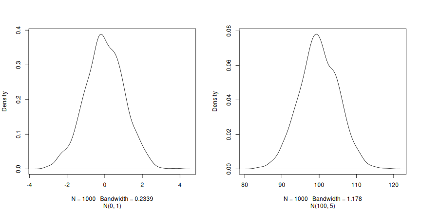

::::::::::::::::::::::::::::::::::::::: objectives

- Define the following terms as they relate to R: object, assign, call, function, arguments, options.
- Assign values to objects in R.
- Learn how to *name* objects
- Use comments to inform script.
- Solve simple arithmetic operations in R.
- Call functions and use arguments to change their default options.
- Inspect the content of vectors and manipulate their content.
- Subset and extract values from vectors.
- Analyze vectors with missing data.

::::::::::::::::::::::::::::::::::::::::::::::::::

:::::::::::::::::::::::::::::::::::::::: questions

- First commands in R

::::::::::::::::::::::::::::::::::::::::::::::::::

## Creating objects in R

You can get output from R simply by typing math in the console:


```r
3 + 5
```

```{.output}
[1] 8
```

```r
12 / 7
```

```{.output}
[1] 1.714286
```

However, to do useful and interesting things, we need to assign *values* to
*objects*. To create an object, we need to give it a name followed by the
assignment operator `<-`, and the value we want to give it:


```r
weight_kg <- 55
```

`<-` is the assignment operator. It assigns values on the right to
objects on the left. So, after executing `x <- 3`, the value of `x` is
`3`. The arrow can be read as 3 **goes into** `x`.  For historical
reasons, you can also use `=` for assignments, but not in every
context. Because of the
[slight differences](https://blog.revolutionanalytics.com/2008/12/use-equals-or-arrow-for-assignment.html)
in syntax, it is good practice to always use `<-` for assignments.

In RStudio, typing <kbd>Alt</kbd> + <kbd>\-</kbd> (push <kbd>Alt</kbd>
at the same time as the <kbd>\-</kbd> key) will write `<-` in a single
keystroke in a PC, while typing <kbd>Option</kbd> + <kbd>\-</kbd> (push
<kbd>Option</kbd> at the same time as the <kbd>\-</kbd> key) does the
same in a Mac.

### Naming variables

Objects can be given any name such as `x`, `current_temperature`, or
`subject_id`. You want your object names to be explicit and not too
long. They cannot start with a number (`2x` is not valid, but `x2`
is). R is case sensitive (e.g., `weight_kg` is different from
`Weight_kg`). There are some names that cannot be used because they
are the names of fundamental functions in R (e.g., `if`, `else`,
`for`, see
[here](https://stat.ethz.ch/R-manual/R-devel/library/base/html/Reserved.html)
for a complete list). In general, even if it's allowed, it's best to
not use other function names (e.g., `c`, `T`, `mean`, `data`, `df`,
`weights`). If in doubt, check the help to see if the name is already
in use. It's also best to avoid dots (`.`) within an object name as in
`my.dataset`. There are many functions in R with dots in their names
for historical reasons, but because dots have a special meaning in R
(for methods) and other programming languages, it's best to avoid
them. It is also recommended to use nouns for object names, and verbs
for function names. It's important to be consistent in the styling of
your code (where you put spaces, how you name objects, etc.). Using a
consistent coding style makes your code clearer to read for your
future self and your collaborators. In R, some popular style guides
are [Google's](https://google.github.io/styleguide/Rguide.xml), the
[tidyverse's](https://style.tidyverse.org/) style and the [Bioconductor
style
guide](https://bioconductor.org/developers/how-to/coding-style/). The
tidyverse's is very comprehensive and may seem overwhelming at
first. You can install the
[**`lintr`**](https://github.com/jimhester/lintr) package to
automatically check for issues in the styling of your code.

> **Objects vs. variables**: What are known as `objects` in `R` are
> known as `variables` in many other programming languages. Depending
> on the context, `object` and `variable` can have drastically
> different meanings. However, in this lesson, the two words are used
> synonymously. For more information
> [see here.](https://cran.r-project.org/doc/manuals/r-release/R-lang.html#Objects)

When assigning a value to an object, R does not print anything. You
can force R to print the value by using parentheses or by typing the
object name:


```r
weight_kg <- 55    # doesn't print anything
(weight_kg <- 55)  # but putting parenthesis around the call prints the value of `weight_kg`
```

```{.output}
[1] 55
```

```r
weight_kg          # and so does typing the name of the object
```

```{.output}
[1] 55
```

Now that R has `weight_kg` in memory, we can do arithmetic with it. For
instance, we may want to convert this weight into pounds (weight in pounds is 2.2 times the weight in kg):


```r
2.2 * weight_kg
```

```{.output}
[1] 121
```

We can also change an object's value by assigning it a new one:


```r
weight_kg <- 57.5
2.2 * weight_kg
```

```{.output}
[1] 126.5
```

This means that assigning a value to one object does not change the values of
other objects  For example, let's store the animal's weight in pounds in a new
object, `weight_lb`:


```r
weight_lb <- 2.2 * weight_kg
```

and then change `weight_kg` to 100.


```r
weight_kg <- 100
```

:::::::::::::::::::::::::::::::::::::::  challenge

## Challenge:

What do you think is the current content of the object `weight_lb`?
126\.5 or 220?


::::::::::::::::::::::::::::::::::::::::::::::::::

## Comments

The comment character in R is `#`, anything to the right of a `#` in a
script will be ignored by R. It is useful to leave notes, and
explanations in your scripts.

RStudio makes it easy to comment or uncomment a paragraph: after
selecting the lines you want to comment, press at the same time on
your keyboard <kbd>Ctrl</kbd> + <kbd>Shift</kbd> + <kbd>C</kbd>. If
you only want to comment out one line, you can put the cursor at any
location of that line (i.e. no need to select the whole line), then
press <kbd>Ctrl</kbd> + <kbd>Shift</kbd> + <kbd>C</kbd>.

:::::::::::::::::::::::::::::::::::::::  challenge

## Challenge

What are the values after each statement in the following?


```r
mass <- 47.5            # mass?
age  <- 122             # age?
mass <- mass * 2.0      # mass?
age  <- age - 20        # age?
mass_index <- mass/age  # mass_index?
```

::::::::::::::::::::::::::::::::::::::::::::::::::

## Functions and their arguments

Functions are "canned scripts" that automate more complicated sets of commands
including operations assignments, etc. Many functions are predefined, or can be
made available by importing R *packages* (more on that later). A function
usually gets one or more inputs called *arguments*. Functions often (but not
always) return a *value*. A typical example would be the function `sqrt()`. The
input (the argument) must be a number, and the return value (in fact, the
output) is the square root of that number. Executing a function ('running it')
is called *calling* the function. An example of a function call is:


```r
b <- sqrt(a)
```

Here, the value of `a` is given to the `sqrt()` function, the `sqrt()` function
calculates the square root, and returns the value which is then assigned to
the object `b`. This function is very simple, because it takes just one argument.

The return 'value' of a function need not be numerical (like that of `sqrt()`),
and it also does not need to be a single item: it can be a set of things, or
even a dataset. We'll see that when we read data files into R.

Arguments can be anything, not only numbers or filenames, but also other
objects. Exactly what each argument means differs per function, and must be
looked up in the documentation (see below). Some functions take arguments which
may either be specified by the user, or, if left out, take on a *default* value:
these are called *options*. Options are typically used to alter the way the
function operates, such as whether it ignores 'bad values', or what symbol to
use in a plot.  However, if you want something specific, you can specify a value
of your choice which will be used instead of the default.

Let's try a function that can take multiple arguments: `round()`.


```r
round(3.14159)
```

```{.output}
[1] 3
```

Here, we've called `round()` with just one argument, `3.14159`, and it has
returned the value `3`.  That's because the default is to round to the nearest
whole number. If we want more digits we can see how to do that by getting
information about the `round` function.  We can use `args(round)` or look at the
help for this function using `?round`.


```r
args(round)
```

```{.output}
function (x, digits = 0) 
NULL
```


```r
?round
```

We see that if we want a different number of digits, we can
type `digits=2` or however many we want.


```r
round(3.14159, digits = 2)
```

```{.output}
[1] 3.14
```

If you provide the arguments in the exact same order as they are defined you
don't have to name them:


```r
round(3.14159, 2)
```

```{.output}
[1] 3.14
```

And if you do name the arguments, you can switch their order:


```r
round(digits = 2, x = 3.14159)
```

```{.output}
[1] 3.14
```

It's good practice to put the non-optional arguments (like the number you're
rounding) first in your function call, and to specify the names of all optional
arguments.  If you don't, someone reading your code might have to look up the
definition of a function with unfamiliar arguments to understand what you're
doing. By specifying the name of the arguments you are also safeguarding
against possible future changes in the function interface, which may
potentially add new arguments in between the existing ones.

## Vectors and data types

A vector is the most common and basic data type in R, and is pretty much
the workhorse of R. A vector is composed by a series of values, such as
numbers or characters. We can assign a series of values to a vector using
the `c()` function. For example we can create a vector of animal weights and assign
it to a new object `weight_g`:


```r
weight_g <- c(50, 60, 65, 82)
weight_g
```

```{.output}
[1] 50 60 65 82
```

A vector can also contain characters:


```r
molecules <- c("dna", "rna", "protein")
molecules
```

```{.output}
[1] "dna"     "rna"     "protein"
```

The quotes around "dna", "rna", etc. are essential here. Without the
quotes R will assume there are objects called `dna`, `rna` and
`protein`. As these objects don't exist in R's memory, there will be
an error message.

There are many functions that allow you to inspect the content of a
vector. `length()` tells you how many elements are in a particular vector:


```r
length(weight_g)
```

```{.output}
[1] 4
```

```r
length(molecules)
```

```{.output}
[1] 3
```

An important feature of a vector, is that all of the elements are the
same type of data.  The function `class()` indicates the class (the
type of element) of an object:


```r
class(weight_g)
```

```{.output}
[1] "numeric"
```

```r
class(molecules)
```

```{.output}
[1] "character"
```

The function `str()` provides an overview of the structure of an
object and its elements. It is a useful function when working with
large and complex objects:


```r
str(weight_g)
```

```{.output}
 num [1:4] 50 60 65 82
```

```r
str(molecules)
```

```{.output}
 chr [1:3] "dna" "rna" "protein"
```

You can use the `c()` function to add other elements to your vector:


```r
weight_g <- c(weight_g, 90) # add to the end of the vector
weight_g <- c(30, weight_g) # add to the beginning of the vector
weight_g
```

```{.output}
[1] 30 50 60 65 82 90
```

In the first line, we take the original vector `weight_g`, add the
value `90` to the end of it, and save the result back into
`weight_g`. Then we add the value `30` to the beginning, again saving
the result back into `weight_g`.

We can do this over and over again to grow a vector, or assemble a
dataset.  As we program, this may be useful to add results that we are
collecting or calculating.

An **atomic vector** is the simplest R **data type** and is a linear
vector of a single type. Above, we saw 2 of the 6 main **atomic
vector** types that R uses: `"character"` and `"numeric"` (or
`"double"`). These are the basic building blocks that all R objects
are built from. The other 4 **atomic vector** types are:

- `"logical"` for `TRUE` and `FALSE` (the boolean data type)
- `"integer"` for integer numbers (e.g., `2L`, the `L` indicates to R
  that it's an integer)
- `"complex"` to represent complex numbers with real and imaginary
  parts (e.g., `1 + 4i`) and that's all we're going to say about them
- `"raw"` for bitstreams that we won't discuss further

You can check the type of your vector using the `typeof()` function
and inputting your vector as the argument.

Vectors are one of the many **data structures** that R uses. Other
important ones are lists (`list`), matrices (`matrix`), data frames
(`data.frame`), factors (`factor`) and arrays (`array`).

:::::::::::::::::::::::::::::::::::::::  challenge

## Challenge:

We've seen that atomic vectors can be of type character, numeric (or
double), integer, and logical. But what happens if we try to mix
these types in a single vector?

:::::::::::::::  solution

## Solution

R implicitly converts them to all be the same type


:::::::::::::::::::::::::

::::::::::::::::::::::::::::::::::::::::::::::::::

:::::::::::::::::::::::::::::::::::::::  challenge

## Challenge:

What will happen in each of these examples? (hint: use `class()` to
check the data type of your objects and type in their names to see what happens):


```r
num_char <- c(1, 2, 3, "a")
num_logical <- c(1, 2, 3, TRUE, FALSE)
char_logical <- c("a", "b", "c", TRUE)
tricky <- c(1, 2, 3, "4")
```

:::::::::::::::  solution

## Solution


```r
class(num_char)
```

```{.output}
[1] "character"
```

```r
num_char
```

```{.output}
[1] "1" "2" "3" "a"
```

```r
class(num_logical)
```

```{.output}
[1] "numeric"
```

```r
num_logical
```

```{.output}
[1] 1 2 3 1 0
```

```r
class(char_logical)
```

```{.output}
[1] "character"
```

```r
char_logical
```

```{.output}
[1] "a"    "b"    "c"    "TRUE"
```

```r
class(tricky)
```

```{.output}
[1] "character"
```

```r
tricky
```

```{.output}
[1] "1" "2" "3" "4"
```

:::::::::::::::::::::::::

::::::::::::::::::::::::::::::::::::::::::::::::::

:::::::::::::::::::::::::::::::::::::::  challenge

## Challenge:

Why do you think it happens?

:::::::::::::::  solution

## Solution

Vectors can be of only one data type. R tries to convert (coerce)
the content of this vector to find a *common denominator* that
doesn't lose any information.


:::::::::::::::::::::::::

::::::::::::::::::::::::::::::::::::::::::::::::::

:::::::::::::::::::::::::::::::::::::::  challenge

## Challenge:

How many values in `combined_logical` are `"TRUE"` (as a character)
in the following example:


```r
num_logical <- c(1, 2, 3, TRUE)
char_logical <- c("a", "b", "c", TRUE)
combined_logical <- c(num_logical, char_logical)
```

:::::::::::::::  solution

## Solution

Only one. There is no memory of past data types, and the coercion
happens the first time the vector is evaluated. Therefore, the `TRUE`
in `num_logical` gets converted into a `1` before it gets converted
into `"1"` in `combined_logical`.


```r
combined_logical
```

```{.output}
[1] "1"    "2"    "3"    "1"    "a"    "b"    "c"    "TRUE"
```

:::::::::::::::::::::::::

::::::::::::::::::::::::::::::::::::::::::::::::::

:::::::::::::::::::::::::::::::::::::::  challenge

## Challenge:

In R, we call converting objects from one class into another class
*coercion*. These conversions happen according to a hierarchy,
whereby some types get preferentially coerced into other types. Can
you draw a diagram that represents the hierarchy of how these data
types are coerced?

:::::::::::::::  solution

## Solution

logical → numeric → character ← logical


:::::::::::::::::::::::::

::::::::::::::::::::::::::::::::::::::::::::::::::


## Subsetting vectors

If we want to extract one or several values from a vector, we must
provide one or several indices in square brackets. For instance:


```r
molecules <- c("dna", "rna", "peptide", "protein")
molecules[2]
```

```{.output}
[1] "rna"
```

```r
molecules[c(3, 2)]
```

```{.output}
[1] "peptide" "rna"    
```

We can also repeat the indices to create an object with more elements
than the original one:


```r
more_molecules <- molecules[c(1, 2, 3, 2, 1, 4)]
more_molecules
```

```{.output}
[1] "dna"     "rna"     "peptide" "rna"     "dna"     "protein"
```

R indices start at 1. Programming languages like Fortran, MATLAB,
Julia, and R start counting at 1, because that's what human beings
typically do. Languages in the C family (including C++, Java, Perl,
and Python) count from 0 because that's simpler for computers to do.

Finally, it is also possible to get all the elements of a vector
except some specified elements using negative indices:


```r
molecules ## all molecules
```

```{.output}
[1] "dna"     "rna"     "peptide" "protein"
```

```r
molecules[-1] ## all but the first one
```

```{.output}
[1] "rna"     "peptide" "protein"
```

```r
molecules[-c(1, 3)] ## all but 1st/3rd ones
```

```{.output}
[1] "rna"     "protein"
```

```r
molecules[c(-1, -3)] ## all but 1st/3rd ones
```

```{.output}
[1] "rna"     "protein"
```

## Conditional subsetting

Another common way of subsetting is by using a logical vector. `TRUE` will
select the element with the same index, while `FALSE` will not:


```r
weight_g <- c(21, 34, 39, 54, 55)
weight_g[c(TRUE, FALSE, TRUE, TRUE, FALSE)]
```

```{.output}
[1] 21 39 54
```

Typically, these logical vectors are not typed by hand, but are the
output of other functions or logical tests. For instance, if you
wanted to select only the values above 50:


```r
## will return logicals with TRUE for the indices that meet
## the condition
weight_g > 50
```

```{.output}
[1] FALSE FALSE FALSE  TRUE  TRUE
```

```r
## so we can use this to select only the values above 50
weight_g[weight_g > 50]
```

```{.output}
[1] 54 55
```

You can combine multiple tests using `&` (both conditions are true,
AND) or `|` (at least one of the conditions is true, OR):


```r
weight_g[weight_g < 30 | weight_g > 50]
```

```{.output}
[1] 21 54 55
```

```r
weight_g[weight_g >= 30 & weight_g == 21]
```

```{.output}
numeric(0)
```

Here, `<` stands for "less than", `>` for "greater than", `>=` for
"greater than or equal to", and `==` for "equal to". The double equal
sign `==` is a test for numerical equality between the left and right
hand sides, and should not be confused with the single `=` sign, which
performs variable assignment (similar to `<-`).

A common task is to search for certain strings in a vector.  One could
use the "or" operator `|` to test for equality to multiple values, but
this can quickly become tedious. The function `%in%` allows you to
test if any of the elements of a search vector are found:


```r
molecules <- c("dna", "rna", "protein", "peptide")
molecules[molecules == "rna" | molecules == "dna"] # returns both rna and dna
```

```{.output}
[1] "dna" "rna"
```

```r
molecules %in% c("rna", "dna", "metabolite", "peptide", "glycerol")
```

```{.output}
[1]  TRUE  TRUE FALSE  TRUE
```

```r
molecules[molecules %in% c("rna", "dna", "metabolite", "peptide", "glycerol")]
```

```{.output}
[1] "dna"     "rna"     "peptide"
```

:::::::::::::::::::::::::::::::::::::::  challenge

## Challenge:

Can you figure out why `"four" > "five"` returns `TRUE`?

:::::::::::::::  solution

## Solution


```r
"four" > "five"
```

```{.output}
[1] TRUE
```

When using `>` or `<` on strings, R compares their alphabetical order.
Here `"four"` comes after `"five"`, and therefore is *greater than*
it.


:::::::::::::::::::::::::

::::::::::::::::::::::::::::::::::::::::::::::::::

## Names

It is possible to name each element of a vector. The code chunk below
shows an initial vector without any names, how names are set, and
retrieved.


```r
x <- c(1, 5, 3, 5, 10)
names(x) ## no names
```

```{.output}
NULL
```

```r
names(x) <- c("A", "B", "C", "D", "E")
names(x) ## now we have names
```

```{.output}
[1] "A" "B" "C" "D" "E"
```

When a vector has names, it is possible to access elements by their
name, in addition to their index.


```r
x[c(1, 3)]
```

```{.output}
A C 
1 3 
```

```r
x[c("A", "C")]
```

```{.output}
A C 
1 3 
```

## Missing data

As R was designed to analyze datasets, it includes the concept of
missing data (which is uncommon in other programming
languages). Missing data are represented in vectors as `NA`.

When doing operations on numbers, most functions will return `NA` if
the data you are working with include missing values. This feature
makes it harder to overlook the cases where you are dealing with
missing data.  You can add the argument `na.rm = TRUE` to calculate
the result while ignoring the missing values.


```r
heights <- c(2, 4, 4, NA, 6)
mean(heights)
```

```{.output}
[1] NA
```

```r
max(heights)
```

```{.output}
[1] NA
```

```r
mean(heights, na.rm = TRUE)
```

```{.output}
[1] 4
```

```r
max(heights, na.rm = TRUE)
```

```{.output}
[1] 6
```

If your data include missing values, you may want to become familiar
with the functions `is.na()`, `na.omit()`, and `complete.cases()`. See
below for examples.


```r
## Extract those elements which are not missing values.
heights[!is.na(heights)]
```

```{.output}
[1] 2 4 4 6
```

```r
## Returns the object with incomplete cases removed.
## The returned object is an atomic vector of type `"numeric"`
## (or `"double"`).
na.omit(heights)
```

```{.output}
[1] 2 4 4 6
attr(,"na.action")
[1] 4
attr(,"class")
[1] "omit"
```

```r
## Extract those elements which are complete cases.
## The returned object is an atomic vector of type `"numeric"`
## (or `"double"`).
heights[complete.cases(heights)]
```

```{.output}
[1] 2 4 4 6
```

:::::::::::::::::::::::::::::::::::::::  challenge

## Challenge:

1. Using this vector of heights in inches, create a new vector with the NAs removed.


```r
heights <- c(63, 69, 60, 65, NA, 68, 61, 70, 61, 59, 64, 69, 63, 63, NA, 72, 65, 64, 70, 63, 65)
```

2. Use the function `median()` to calculate the median of the `heights` vector.
3. Use R to figure out how many people in the set are taller than 67 inches.

:::::::::::::::  solution

## Solution


```r
heights_no_na <- heights[!is.na(heights)]
## or
heights_no_na <- na.omit(heights)
```


```r
median(heights, na.rm = TRUE)
```

```{.output}
[1] 64
```


```r
heights_above_67 <- heights_no_na[heights_no_na > 67]
length(heights_above_67)
```

```{.output}
[1] 6
```

:::::::::::::::::::::::::

::::::::::::::::::::::::::::::::::::::::::::::::::

## Generating vectors {#sec:genvec}


### Constructors

There exists some functions to generate vectors of different type. To
generate a vector of numerics, one can use the `numeric()`
constructor, providing the length of the output vector as
parameter. The values will be initialised with 0.


```r
numeric(3)
```

```{.output}
[1] 0 0 0
```

```r
numeric(10)
```

```{.output}
 [1] 0 0 0 0 0 0 0 0 0 0
```

Note that if we ask for a vector of numerics of length 0, we obtain
exactly that:


```r
numeric(0)
```

```{.output}
numeric(0)
```

There are similar constructors for characters and logicals, named
`character()` and `logical()` respectively.

:::::::::::::::::::::::::::::::::::::::  challenge

## Challenge:

What are the defaults for character and logical vectors?

:::::::::::::::  solution

## Solution


```r
character(2) ## the empty character
```

```{.output}
[1] "" ""
```

```r
logical(2)   ## FALSE
```

```{.output}
[1] FALSE FALSE
```

:::::::::::::::::::::::::

::::::::::::::::::::::::::::::::::::::::::::::::::

### Replicate elements

The `rep` function allow to repeat a value a certain number of
times. If we want to initiate a vector of numerics of length 5 with
the value -1, for example, we could do the following:


```r
rep(-1, 5)
```

```{.output}
[1] -1 -1 -1 -1 -1
```

Similarly, to generate a vector populated with missing values, which
is often a good way to start, without setting assumptions on the data
to be collected:


```r
rep(NA, 5)
```

```{.output}
[1] NA NA NA NA NA
```

`rep` can take vectors of any length as input (above, we used vectors
of length 1) and any type. For example, if we want to repeat the
values 1, 2 and 3 five times, we would do the following:


```r
rep(c(1, 2, 3), 5)
```

```{.output}
 [1] 1 2 3 1 2 3 1 2 3 1 2 3 1 2 3
```

:::::::::::::::::::::::::::::::::::::::  challenge

## Challenge:

What if we wanted to repeat the values 1, 2 and 3 five times, but
obtain five 1s, five 2s and five 3s in that order? There are two
possibilities - see `?rep` or `?sort` for help.

:::::::::::::::  solution

## Solution


```r
rep(c(1, 2, 3), each = 5)
```

```{.output}
 [1] 1 1 1 1 1 2 2 2 2 2 3 3 3 3 3
```

```r
sort(rep(c(1, 2, 3), 5))
```

```{.output}
 [1] 1 1 1 1 1 2 2 2 2 2 3 3 3 3 3
```

:::::::::::::::::::::::::

::::::::::::::::::::::::::::::::::::::::::::::::::

### Sequence generation

Another very useful function is `seq`, to generate a sequence of
numbers. For example, to generate a sequence of integers from 1 to 20
by steps of 2, one would use:


```r
seq(from = 1, to = 20, by = 2)
```

```{.output}
 [1]  1  3  5  7  9 11 13 15 17 19
```

The default value of `by` is 1 and, given that the generation of a
sequence of one value to another with steps of 1 is frequently used,
there's a shortcut:


```r
seq(1, 5, 1)
```

```{.output}
[1] 1 2 3 4 5
```

```r
seq(1, 5) ## default by
```

```{.output}
[1] 1 2 3 4 5
```

```r
1:5
```

```{.output}
[1] 1 2 3 4 5
```

To generate a sequence of numbers from 1 to 20 of final length of 3,
one would use:


```r
seq(from = 1, to = 20, length.out = 3)
```

```{.output}
[1]  1.0 10.5 20.0
```

### Random samples and permutations

A last group of useful functions are those that generate random
data. The first one, `sample`, generates a random permutation of
another vector. For example, to draw a random order to 10 students
oral exam, I first assign each student a number from 1 to ten (for
instance based on the alphabetic order of their name) and then:


```r
sample(1:10)
```

```{.output}
 [1]  9  4  7  1  2  5  3 10  6  8
```

Without further arguments, `sample` will return a permutation of all
elements of the vector. If I want a random sample of a certain size, I
would set this value as the second argument. Below, I sample 5 random
letters from the alphabet contained in the pre-defined `letters` vector:


```r
sample(letters, 5)
```

```{.output}
[1] "s" "a" "u" "x" "j"
```

If I wanted an output larger than the input vector, or being able to
draw some elements multiple times, I would need to set the `replace`
argument to `TRUE`:


```r
sample(1:5, 10, replace = TRUE)
```

```{.output}
 [1] 2 1 5 5 1 1 5 5 2 2
```

:::::::::::::::::::::::::::::::::::::::  challenge

## Challenge:

When trying the functions above out, you will have realised that the
samples are indeed random and that one doesn't get the same
permutation twice. To be able to reproduce these random draws, one can
set the random number generation seed manually with `set.seed()`
before drawing the random sample.

Test this feature with your neighbour. First draw two random
permutations of `1:10` independently and observe that you get
different results.

Now set the seed with, for example, `set.seed(123)` and repeat the
random draw. Observe that you now get the same random draws.

Repeat by setting a different seed.

:::::::::::::::  solution

## Solution

Different permutations


```r
sample(1:10)
```

```{.output}
 [1]  9  1  4  3  6  2  5  8 10  7
```

```r
sample(1:10)
```

```{.output}
 [1]  4  9  7  6  1 10  8  3  2  5
```

Same permutations with seed 123


```r
set.seed(123)
sample(1:10)
```

```{.output}
 [1]  3 10  2  8  6  9  1  7  5  4
```

```r
set.seed(123)
sample(1:10)
```

```{.output}
 [1]  3 10  2  8  6  9  1  7  5  4
```

A different seed


```r
set.seed(1)
sample(1:10)
```

```{.output}
 [1]  9  4  7  1  2  5  3 10  6  8
```

```r
set.seed(1)
sample(1:10)
```

```{.output}
 [1]  9  4  7  1  2  5  3 10  6  8
```

:::::::::::::::::::::::::

::::::::::::::::::::::::::::::::::::::::::::::::::

### Drawing samples from a normal distribution

The last function we are going to see is `rnorm`, that draws a random
sample from a normal distribution. Two normal distributions of means 0
and 100 and standard deviations 1 and 5, noted *N(0, 1)* and
*N(100, 5)*, are shown below.

<div class="figure" style="text-align: center">

<p class="caption">Two normal distributions: *N(0, 1)* on the left and *N(100, 5)* on the right.</p>
</div>

The three arguments, `n`, `mean` and `sd`, define the size of the
sample, and the parameters of the normal distribution, i.e the mean
and its standard deviation. The defaults of the latter are 0 and 1.


```r
rnorm(5)
```

```{.output}
[1]  0.69641761  0.05351568 -1.31028350 -2.12306606 -0.20807859
```

```r
rnorm(5, 2, 2)
```

```{.output}
[1]  1.3744268 -0.1164714  2.8344472  1.3690969  3.6510983
```

```r
rnorm(5, 100, 5)
```

```{.output}
[1] 106.45636  96.87448  95.62427 100.71678 107.12595
```

Now that we have learned how to write scripts, and the basics of R's
data structures, we are ready to start working with larger data, and
learn about data frames.

:::::::::::::::::::::::::::::::::::::::: keypoints

- How to interact with R

::::::::::::::::::::::::::::::::::::::::::::::::::
