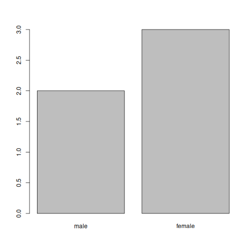

::::::::::::::::::::::::::::::::::::::: objectives

- Describe what a `data.frame` is.
- Load external data from a .csv file into a data frame.
- Summarize the contents of a data frame.
- Describe what a factor is.
- Convert between strings and factors.
- Reorder and rename factors.
- Format dates.
- Export and save data.

::::::::::::::::::::::::::::::::::::::::::::::::::

:::::::::::::::::::::::::::::::::::::::: questions

- First data analysis in R

::::::::::::::::::::::::::::::::::::::::::::::::::

## Presentation of the gene expression data

We are going to use part of the data published by [Blackmore *et al.*
(2017)](https://www.ncbi.nlm.nih.gov/pmc/articles/PMC5544260/), *The
effect of upper-respiratory infection on transcriptomic changes in the
CNS*. The goal of the study was to determine the effect of an
upper-respiratory infection on changes in RNA transcription occurring
in the cerebellum and spinal cord post infection. Gender matched eight
week old C57BL/6 mice were inoculated with saline or with Influenza A by
intranasal route and transcriptomic changes in the cerebellum and
spinal cord tissues were evaluated by RNA-seq at days 0
(non-infected), 4 and 8.

The dataset is stored as a comma-separated values (CSV) file.  Each row
holds information for a single RNA expression measurement, and the first eleven
columns represent:

| Column     | Description                                                                                  |
| ---------- | -------------------------------------------------------------------------------------------- |
| gene       | The name of the gene that was measured                                                       |
| sample     | The name of the sample the gene expression was measured in                                   |
| expression | The value of the gene expression                                                             |
| organism   | The organism/species - here all data stem from mice                                          |
| age        | The age of the mouse (all mice were 8 weeks here)                                            |
| sex        | The sex of the mouse                                                                         |
| infection  | The infection state of the mouse, i.e. infected with Influenza A or not infected.            |
| strain     | The Influenza A strain.                                                                      |
| time       | The duration of the infection (in days).                                                     |
| tissue     | The tissue that was used for the gene expression experiment, i.e. cerebellum or spinal cord. |
| mouse      | The mouse unique identifier.                                                                 |

We are going to use the R function `download.file()` to download the
CSV file that contains the gene expression data, and we will use
`read.csv()` to load into memory the content of the CSV file as an
object of class `data.frame`.  Inside the `download.file` command, the
first entry is a character string with the source URL. This source URL
downloads a CSV file from a GitHub repository. The text after the
comma (`"data/rnaseq.csv"`) is the destination of the file on your
local machine. You'll need to have a folder on your machine called
`"data"` where you'll download the file. So this command downloads the
remote file, names it `"rnaseq.csv"` and adds it to a preexisting
folder named `"data"`.


```r
download.file(url = "https://github.com/carpentries-incubator/bioc-intro/raw/main/episodes/data/rnaseq.csv",
              destfile = "data/rnaseq.csv")
```

You are now ready to load the data:


```r
rna <- read.csv("data/rnaseq.csv")
```

This statement doesn't produce any output because, as you might
recall, assignments don't display anything. If we want to check that
our data has been loaded, we can see the contents of the data frame by
typing its name:


```r
rna
```

Wow... that was a lot of output. At least it means the data loaded
properly. Let's check the top (the first 6 lines) of this data frame
using the function `head()`:


```r
head(rna)
```

```{.output}
     gene     sample expression     organism age    sex  infection  strain time
1     Asl GSM2545336       1170 Mus musculus   8 Female InfluenzaA C57BL/6    8
2    Apod GSM2545336      36194 Mus musculus   8 Female InfluenzaA C57BL/6    8
3 Cyp2d22 GSM2545336       4060 Mus musculus   8 Female InfluenzaA C57BL/6    8
4    Klk6 GSM2545336        287 Mus musculus   8 Female InfluenzaA C57BL/6    8
5   Fcrls GSM2545336         85 Mus musculus   8 Female InfluenzaA C57BL/6    8
6  Slc2a4 GSM2545336        782 Mus musculus   8 Female InfluenzaA C57BL/6    8
      tissue mouse ENTREZID
1 Cerebellum    14   109900
2 Cerebellum    14    11815
3 Cerebellum    14    56448
4 Cerebellum    14    19144
5 Cerebellum    14    80891
6 Cerebellum    14    20528
                                                                       product
1                               argininosuccinate lyase, transcript variant X1
2                                       apolipoprotein D, transcript variant 3
3 cytochrome P450, family 2, subfamily d, polypeptide 22, transcript variant 2
4                         kallikrein related-peptidase 6, transcript variant 2
5                Fc receptor-like S, scavenger receptor, transcript variant X1
6          solute carrier family 2 (facilitated glucose transporter), member 4
     ensembl_gene_id external_synonym chromosome_name   gene_biotype
1 ENSMUSG00000025533    2510006M18Rik               5 protein_coding
2 ENSMUSG00000022548             <NA>              16 protein_coding
3 ENSMUSG00000061740             2D22              15 protein_coding
4 ENSMUSG00000050063             Bssp               7 protein_coding
5 ENSMUSG00000015852    2810439C17Rik               3 protein_coding
6 ENSMUSG00000018566           Glut-4              11 protein_coding
                            phenotype_description
1           abnormal circulating amino acid level
2                      abnormal lipid homeostasis
3                        abnormal skin morphology
4                         abnormal cytokine level
5 decreased CD8-positive alpha-beta T cell number
6              abnormal circulating glucose level
  hsapiens_homolog_associated_gene_name
1                                   ASL
2                                  APOD
3                                CYP2D6
4                                  KLK6
5                                 FCRL2
6                                SLC2A4
```

```r
## Try also
## View(rna)
```

**Note**

`read.csv()` assumes that fields are delineated by commas, however, in
several countries, the comma is used as a decimal separator and the
semicolon (;) is used as a field delineator. If you want to read in
this type of files in R, you can use the `read.csv2()` function. It
behaves exactly like `read.csv()` but uses different parameters for
the decimal and the field separators. If you are working with another
format, they can be both specified by the user. Check out the help for
`read.csv()` by typing `?read.csv` to learn more. There is also the
`read.delim()` function for reading tab separated data files. It is important to
note that all of these functions are actually wrapper functions for
the main `read.table()` function with different arguments.  As such,
the data above could have also been loaded by using `read.table()`
with the separation argument as `,`. The code is as follows:


```r
rna <- read.table(file = "data/rnaseq.csv",
                  sep = ",",
                  header = TRUE)
```

The header argument has to be set to TRUE to be able to read the
headers as by default `read.table()` has the header argument set to
FALSE.

## What are data frames?

Data frames are the *de facto* data structure for most tabular data,
and what we use for statistics and plotting.

A data frame can be created by hand, but most commonly they are
generated by the functions `read.csv()` or `read.table()`; in other
words, when importing spreadsheets from your hard drive (or the web).

A data frame is the representation of data in the format of a table
where the columns are vectors that all have the same length. Because
columns are vectors, each column must contain a single type of data
(e.g., characters, integers, factors). For example, here is a figure
depicting a data frame comprising a numeric, a character, and a
logical vector.


We can see this when inspecting the <b>str</b>ucture of a data frame
with the function `str()`:


```r
str(rna)
```

```{.output}
'data.frame':	32428 obs. of  19 variables:
 $ gene                                 : chr  "Asl" "Apod" "Cyp2d22" "Klk6" ...
 $ sample                               : chr  "GSM2545336" "GSM2545336" "GSM2545336" "GSM2545336" ...
 $ expression                           : int  1170 36194 4060 287 85 782 1619 288 43217 1071 ...
 $ organism                             : chr  "Mus musculus" "Mus musculus" "Mus musculus" "Mus musculus" ...
 $ age                                  : int  8 8 8 8 8 8 8 8 8 8 ...
 $ sex                                  : chr  "Female" "Female" "Female" "Female" ...
 $ infection                            : chr  "InfluenzaA" "InfluenzaA" "InfluenzaA" "InfluenzaA" ...
 $ strain                               : chr  "C57BL/6" "C57BL/6" "C57BL/6" "C57BL/6" ...
 $ time                                 : int  8 8 8 8 8 8 8 8 8 8 ...
 $ tissue                               : chr  "Cerebellum" "Cerebellum" "Cerebellum" "Cerebellum" ...
 $ mouse                                : int  14 14 14 14 14 14 14 14 14 14 ...
 $ ENTREZID                             : int  109900 11815 56448 19144 80891 20528 97827 118454 18823 14696 ...
 $ product                              : chr  "argininosuccinate lyase, transcript variant X1" "apolipoprotein D, transcript variant 3" "cytochrome P450, family 2, subfamily d, polypeptide 22, transcript variant 2" "kallikrein related-peptidase 6, transcript variant 2" ...
 $ ensembl_gene_id                      : chr  "ENSMUSG00000025533" "ENSMUSG00000022548" "ENSMUSG00000061740" "ENSMUSG00000050063" ...
 $ external_synonym                     : chr  "2510006M18Rik" NA "2D22" "Bssp" ...
 $ chromosome_name                      : chr  "5" "16" "15" "7" ...
 $ gene_biotype                         : chr  "protein_coding" "protein_coding" "protein_coding" "protein_coding" ...
 $ phenotype_description                : chr  "abnormal circulating amino acid level" "abnormal lipid homeostasis" "abnormal skin morphology" "abnormal cytokine level" ...
 $ hsapiens_homolog_associated_gene_name: chr  "ASL" "APOD" "CYP2D6" "KLK6" ...
```

## Inspecting `data.frame` Objects

We already saw how the functions `head()` and `str()` can be useful to
check the content and the structure of a data frame. Here is a
non-exhaustive list of functions to get a sense of the
content/structure of the data. Let's try them out!

**Size**:

- `dim(rna)` - returns a vector with the number of rows as the first
  element, and the number of columns as the second element (the
  **dim**ensions of the object).
- `nrow(rna)` - returns the number of rows.
- `ncol(rna)` - returns the number of columns.

**Content**:

- `head(rna)` - shows the first 6 rows.
- `tail(rna)` - shows the last 6 rows.

**Names**:

- `names(rna)` - returns the column names (synonym of `colnames()` for
  `data.frame` objects).
- `rownames(rna)` - returns the row names.

**Summary**:

- `str(rna)` - structure of the object and information about the
  class, length and content of each column.
- `summary(rna)` - summary statistics for each column.

Note: most of these functions are "generic", they can be used on other types of
objects besides `data.frame`.

:::::::::::::::::::::::::::::::::::::::  challenge

## Challenge:

Based on the output of `str(rna)`, can you answer the following
questions?

- What is the class of the object `rna`?
- How many rows and how many columns are in this object?

:::::::::::::::  solution

## Solution

- class: data frame
- how many rows: 66465, how many columns: 11


:::::::::::::::::::::::::

::::::::::::::::::::::::::::::::::::::::::::::::::

## Indexing and subsetting data frames

Our `rna` data frame has rows and columns (it has 2 dimensions); if we
want to extract some specific data from it, we need to specify the
"coordinates" we want. Row numbers come first, followed by
column numbers. However, note that different ways of specifying these
coordinates lead to results with different classes.


```r
# first element in the first column of the data frame (as a vector)
rna[1, 1]
# first element in the 6th column (as a vector)
rna[1, 6]
# first column of the data frame (as a vector)
rna[, 1]
# first column of the data frame (as a data.frame)
rna[1]
# first three elements in the 7th column (as a vector)
rna[1:3, 7]
# the 3rd row of the data frame (as a data.frame)
rna[3, ]
# equivalent to head_rna <- head(rna)
head_rna <- rna[1:6, ]
head_rna
```

`:` is a special function that creates numeric vectors of integers in
increasing or decreasing order, test `1:10` and `10:1` for
instance. See section @ref(sec:genvec) for details.

You can also exclude certain indices of a data frame using the "`-`" sign:


```r
rna[, -1]          ## The whole data frame, except the first column
rna[-c(7:66465), ] ## Equivalent to head(rna)
```

Data frames can be subsetted by calling indices (as shown previously),
but also by calling their column names directly:


```r
rna["gene"]       # Result is a data.frame
rna[, "gene"]     # Result is a vector
rna[["gene"]]     # Result is a vector
rna$gene          # Result is a vector
```

In RStudio, you can use the autocompletion feature to get the full and
correct names of the columns.

:::::::::::::::::::::::::::::::::::::::  challenge

## Challenge

1. Create a `data.frame` (`rna_200`) containing only the data in
  row 200 of the `rna` dataset.

2. Notice how `nrow()` gave you the number of rows in a `data.frame`?

- Use that number to pull out just that last row in the initial
  `rna` data frame.

- Compare that with what you see as the last row using `tail()` to
  make sure it's meeting expectations.

- Pull out that last row using `nrow()` instead of the row number.

- Create a new data frame (`rna_last`) from that last row.

3. Use `nrow()` to extract the row that is in the middle of the
  `rna` dataframe. Store the content of this row in an object
  named `rna_middle`.

4. Combine `nrow()` with the `-` notation above to reproduce the
  behavior of `head(rna)`, keeping just the first through 6th
  rows of the rna dataset.

:::::::::::::::  solution

## Solution


```r
## 1.
rna_200 <- rna[200, ]
## 2.
## Saving `n_rows` to improve readability and reduce duplication
n_rows <- nrow(rna)
rna_last <- rna[n_rows, ]
## 3.
rna_middle <- rna[n_rows / 2, ]
## 4.
rna_head <- rna[-(7:n_rows), ]
```

:::::::::::::::::::::::::

::::::::::::::::::::::::::::::::::::::::::::::::::

## Factors

Factors represent **categorical data**. They are stored as integers
associated with labels and they can be ordered or unordered. While
factors look (and often behave) like character vectors, they are
actually treated as integer vectors by R. So you need to be very
careful when treating them as strings.

Once created, factors can only contain a pre-defined set of values,
known as *levels*. By default, R always sorts levels in alphabetical
order. For instance, if you have a factor with 2 levels:


```r
sex <- factor(c("male", "female", "female", "male", "female"))
```

R will assign `1` to the level `"female"` and `2` to the level
`"male"` (because `f` comes before `m`, even though the first element
in this vector is `"male"`). You can see this by using the function
`levels()` and you can find the number of levels using `nlevels()`:


```r
levels(sex)
```

```{.output}
[1] "female" "male"  
```

```r
nlevels(sex)
```

```{.output}
[1] 2
```

Sometimes, the order of the factors does not matter, other times you
might want to specify the order because it is meaningful (e.g., "low",
"medium", "high"), it improves your visualization, or it is required
by a particular type of analysis. Here, one way to reorder our levels
in the `sex` vector would be:


```r
sex ## current order
```

```{.output}
[1] male   female female male   female
Levels: female male
```

```r
sex <- factor(sex, levels = c("male", "female"))
sex ## after re-ordering
```

```{.output}
[1] male   female female male   female
Levels: male female
```

In R's memory, these factors are represented by integers (1, 2, 3),
but are more informative than integers because factors are self
describing: `"female"`, `"male"` is more descriptive than `1`,
`2`. Which one is "male"?  You wouldn't be able to tell just from the
integer data. Factors, on the other hand, have this information built-in.
It is particularly helpful when there are many levels (like the
gene biotype in our example dataset).

When your data is stored as a factor, you can use the `plot()`
function to get a quick glance at the number of observations
represented by each factor level. Let's look at the number of males
and females in our data.


```r
plot(sex)
```

<div class="figure" style="text-align: center">

<p class="caption">Bar plot of the number of females and males.</p>
</div>

### Converting to character

If you need to convert a factor to a character vector, you use
`as.character(x)`.


```r
as.character(sex)
```

```{.output}
[1] "male"   "female" "female" "male"   "female"
```

<!-- ### Numeric factors -->

<!-- Converting factors where the levels appear as numbers (such as -->

<!-- concentration levels, or years) to a numeric vector is a little -->

<!-- trickier. The `as.numeric()` function returns the index values of the -->

<!-- factor, not its levels, so it will result in an entirely new (and -->

<!-- unwanted in this case) set of numbers.  One method to avoid this is to -->

<!-- convert factors to characters, and then to numbers.  Another method is -->

<!-- to use the `levels()` function. Compare: -->

<!-- ```{r} -->

<!-- year_fct <- factor(c(1990, 1983, 1977, 1998, 1990)) -->

<!-- as.numeric(year_fct)  ## Wrong! And there is no warning... -->

<!-- as.numeric(as.character(year_fct)) ## Works... -->

<!-- as.numeric(levels(year_fct))[year_fct] ## The recommended way. -->

<!-- ```

<!-- Notice that in the `levels()` approach, three important steps occur: -->

<!-- * We obtain all the factor levels using `levels(year_fct)` -->

<!-- * We convert these levels to numeric values using `as.numeric(levels(year_fct))` -->

<!-- * We then access these numeric values using the underlying integers of the -->

<!--   vector `year_fct` inside the square brackets -->

### Renaming factors

If we want to rename these factor, it is sufficient to change its
levels:


```r
levels(sex)
```

```{.output}
[1] "male"   "female"
```

```r
levels(sex) <- c("M", "F")
sex
```

```{.output}
[1] M F F M F
Levels: M F
```

```r
plot(sex)
```


::::::::::::::::::::::::::::::::::::::  challenge

## Challenge:

- Rename "F" and "M" to "Female" and "Male" respectively.

:::::::::::::::  solution

## Solution


```r
levels(sex)
```

```{.output}
[1] "M" "F"
```

```r
levels(sex) <- c("Male", "Female")
```

:::::::::::::::::::::::::

::::::::::::::::::::::::::::::::::::::::::::::::::

:::::::::::::::::::::::::::::::::::::::  challenge

## Challenge:

We have seen how data frames are created when using `read.csv()`, but
they can also be created by hand with the `data.frame()` function.
There are a few mistakes in this hand-crafted `data.frame`. Can you
spot and fix them?  Don't hesitate to experiment!


```r
animal_data <- data.frame(
       animal = c(dog, cat, sea cucumber, sea urchin),
       feel = c("furry", "squishy", "spiny"),
       weight = c(45, 8 1.1, 0.8))
```

:::::::::::::::  solution

## Solution

- missing quotations around the names of the animals
- missing one entry in the "feel" column (probably for one of the furry animals)
- missing one comma in the weight column

:::::::::::::::::::::::::

::::::::::::::::::::::::::::::::::::::::::::::::::

:::::::::::::::::::::::::::::::::::::::  challenge

## Challenge:

Can you predict the class for each of the columns in the following
example?

Check your guesses using `str(country_climate)`:

- Are they what you expected?  Why? Why not?

- Try again by adding `stringsAsFactors = TRUE` after the last
  variable when creating the data frame. What is happening now?
  `stringsAsFactors` can also be set when reading text-based
  spreadsheets into R using `read.csv()`.


```r
country_climate <- data.frame(
       country = c("Canada", "Panama", "South Africa", "Australia"),
       climate = c("cold", "hot", "temperate", "hot/temperate"),
       temperature = c(10, 30, 18, "15"),
       northern_hemisphere = c(TRUE, TRUE, FALSE, "FALSE"),
       has_kangaroo = c(FALSE, FALSE, FALSE, 1)
       )
```

:::::::::::::::  solution

## Solution


```r
country_climate <- data.frame(
       country = c("Canada", "Panama", "South Africa", "Australia"),
       climate = c("cold", "hot", "temperate", "hot/temperate"),
       temperature = c(10, 30, 18, "15"),
       northern_hemisphere = c(TRUE, TRUE, FALSE, "FALSE"),
       has_kangaroo = c(FALSE, FALSE, FALSE, 1)
       )
str(country_climate)
```

```{.output}
'data.frame':	4 obs. of  5 variables:
 $ country            : chr  "Canada" "Panama" "South Africa" "Australia"
 $ climate            : chr  "cold" "hot" "temperate" "hot/temperate"
 $ temperature        : chr  "10" "30" "18" "15"
 $ northern_hemisphere: chr  "TRUE" "TRUE" "FALSE" "FALSE"
 $ has_kangaroo       : num  0 0 0 1
```

:::::::::::::::::::::::::

::::::::::::::::::::::::::::::::::::::::::::::::::

The automatic conversion of data type is sometimes a blessing, sometimes an
annoyance. Be aware that it exists, learn the rules, and double check that data
you import in R are of the correct type within your data frame. If not, use it
to your advantage to detect mistakes that might have been introduced during data
entry (a letter in a column that should only contain numbers for instance).

Learn more in this [RStudio
tutorial](https://support.rstudio.com/hc/en-us/articles/218611977-Importing-Data-with-RStudio)

## Matrices

Before proceeding, now that we have learnt about data frames, let's
recap package installation and learn about a new data type, namely the
`matrix`. Like a `data.frame`, a matrix has two dimensions, rows and
columns. But the major difference is that all cells in a `matrix` must
be of the same type: `numeric`, `character`, `logical`, ... In that
respect, matrices are closer to a `vector` than a `data.frame`.

The default constructor for a matrix is `matrix`. It takes a vector of
values to populate the matrix and the number of row and/or
columns[^ncol]. The values are sorted along the columns, as illustrated
below.


```r
m <- matrix(1:9, ncol = 3, nrow = 3)
m
```

```{.output}
     [,1] [,2] [,3]
[1,]    1    4    7
[2,]    2    5    8
[3,]    3    6    9
```

[^ncol]: Either the number of rows or columns are enough, as the other one can be deduced from the length of the values. Try out what happens if the values and number of rows/columns don't add up.

:::::::::::::::::::::::::::::::::::::::  challenge

## Challenge:

Using the function `installed.packages()`, create a `character` matrix
containing the information about all packages currently installed on
your computer. Explore it.

:::::::::::::::  solution

## Solution:


```r
## create the matrix
ip <- installed.packages()
head(ip)
## try also View(ip)
## number of package
nrow(ip)
## names of all installed packages
rownames(ip)
## type of information we have about each package
colnames(ip)
```

:::::::::::::::::::::::::

::::::::::::::::::::::::::::::::::::::::::::::::::

It is often useful to create large random data matrices as test
data. The exercise below asks you to create such a matrix with random
data drawn from a normal distribution of mean 0 and standard deviation
1, which can be done with the `rnorm()` function.

:::::::::::::::::::::::::::::::::::::::  challenge

## Challenge:

Construct a matrix of dimension 1000 by 3 of normally distributed data
(mean 0, standard deviation 1)

:::::::::::::::  solution

## Solution


```r
set.seed(123)
m <- matrix(rnorm(3000), ncol = 3)
dim(m)
```

```{.output}
[1] 1000    3
```

```r
head(m)
```

```{.output}
            [,1]        [,2]       [,3]
[1,] -0.56047565 -0.99579872 -0.5116037
[2,] -0.23017749 -1.03995504  0.2369379
[3,]  1.55870831 -0.01798024 -0.5415892
[4,]  0.07050839 -0.13217513  1.2192276
[5,]  0.12928774 -2.54934277  0.1741359
[6,]  1.71506499  1.04057346 -0.6152683
```

:::::::::::::::::::::::::

::::::::::::::::::::::::::::::::::::::::::::::::::

## Formatting Dates

One of the most common issues that new (and experienced!) R users have
is converting date and time information into a variable that is
appropriate and usable during analyses.

### Note on dates in spreadsheet programs

Dates in spreadsheets are generally stored in a single column. While
this seems the most natural way to record dates, it actually is not
best practice. A spreadsheet application will display the dates in a
seemingly correct way (to a human observer) but how it actually
handles and stores the dates may be problematic. It is often much
safer to store dates with YEAR, MONTH and DAY in separate columns or
as YEAR and DAY-OF-YEAR in separate columns.

Spreadsheet programs such as LibreOffice, Microsoft Excel, OpenOffice,
Gnumeric, ... have different (and often incompatible) ways of encoding
dates (even for the same program between versions and operating
systems). Additionally, Excel can [turn things that aren't dates into
dates](https://nsaunders.wordpress.com/2012/10/22/gene-name-errors-and-excel-lessons-not-learned/)
(@Zeeberg:2004), for example names or identifiers like MAR1, DEC1,
OCT4. So if you're avoiding the date format overall, it's easier to
identify these issues.

The [Dates as
data](https://datacarpentry.org/spreadsheet-ecology-lesson/03-dates-as-data/index.html)
section of the Data Carpentry lesson provides additional insights
about pitfalls of dates with spreadsheets.

We are going to use the `ymd()` function from the package
**`lubridate`** (which belongs to the **`tidyverse`**; learn more
[here](https://www.tidyverse.org/)). . **`lubridate`** gets installed
as part of the **`tidyverse`** installation. When you load the
**`tidyverse`** (`library(tidyverse)`), the core packages (the
packages used in most data analyses) get loaded. **`lubridate`**
however does not belong to the core tidyverse, so you have to load it
explicitly with `library(lubridate)`.

Start by loading the required package:


```r
library("lubridate")
```

`ymd()` takes a vector representing year, month, and day, and converts
it to a `Date` vector. `Date` is a class of data recognized by R as
being a date and can be manipulated as such. The argument that the
function requires is flexible, but, as a best practice, is a character
vector formatted as "YYYY-MM-DD".

Let's create a date object and inspect the structure:


```r
my_date <- ymd("2015-01-01")
str(my_date)
```

```{.output}
 Date[1:1], format: "2015-01-01"
```

Now let's paste the year, month, and day separately - we get the same result:


```r
# sep indicates the character to use to separate each component
my_date <- ymd(paste("2015", "1", "1", sep = "-"))
str(my_date)
```

```{.output}
 Date[1:1], format: "2015-01-01"
```

Let's now familiarise ourselves with a typical date manipulation
pipeline. The small data below has stored dates in different `year`,
`month` and `day` columns.


```r
x <- data.frame(year = c(1996, 1992, 1987, 1986, 2000, 1990, 2002, 1994, 1997, 1985),
                month = c(2,  3,  3, 10,  1,  8,  3,  4,  5,  5),
                day = c(24,  8,  1,  5,  8, 17, 13, 10, 11, 24),
                value = c(4,  5,  1,  9,  3,  8, 10,  2,  6,  7))
x
```

```{.output}
   year month day value
1  1996     2  24     4
2  1992     3   8     5
3  1987     3   1     1
4  1986    10   5     9
5  2000     1   8     3
6  1990     8  17     8
7  2002     3  13    10
8  1994     4  10     2
9  1997     5  11     6
10 1985     5  24     7
```

Now we apply this function to the `x` dataset. We first create a
character vector from the `year`, `month`, and `day` columns of `x`
using `paste()`:


```r
paste(x$year, x$month, x$day, sep = "-")
```

```{.output}
 [1] "1996-2-24" "1992-3-8"  "1987-3-1"  "1986-10-5" "2000-1-8"  "1990-8-17"
 [7] "2002-3-13" "1994-4-10" "1997-5-11" "1985-5-24"
```

This character vector can be used as the argument for `ymd()`:


```r
ymd(paste(x$year, x$month, x$day, sep = "-"))
```

```{.output}
 [1] "1996-02-24" "1992-03-08" "1987-03-01" "1986-10-05" "2000-01-08"
 [6] "1990-08-17" "2002-03-13" "1994-04-10" "1997-05-11" "1985-05-24"
```

The resulting `Date` vector can be added to `x` as a new column called `date`:


```r
x$date <- ymd(paste(x$year, x$month, x$day, sep = "-"))
str(x) # notice the new column, with 'date' as the class
```

```{.output}
'data.frame':	10 obs. of  5 variables:
 $ year : num  1996 1992 1987 1986 2000 ...
 $ month: num  2 3 3 10 1 8 3 4 5 5
 $ day  : num  24 8 1 5 8 17 13 10 11 24
 $ value: num  4 5 1 9 3 8 10 2 6 7
 $ date : Date, format: "1996-02-24" "1992-03-08" ...
```

Let's make sure everything worked correctly. One way to inspect the
new column is to use `summary()`:


```r
summary(x$date)
```

```{.output}
        Min.      1st Qu.       Median         Mean      3rd Qu.         Max. 
"1985-05-24" "1988-01-11" "1993-03-24" "1993-03-18" "1997-01-20" "2002-03-13" 
```

Note that `ymd()` expects to have the year, month and day, in that
order. If you have for instance day, month and year, you would need
`dmy()`.


```r
dmy(paste(x$day, x$month, x$year, sep = "-"))
```

```{.output}
 [1] "1996-02-24" "1992-03-08" "1987-03-01" "1986-10-05" "2000-01-08"
 [6] "1990-08-17" "2002-03-13" "1994-04-10" "1997-05-11" "1985-05-24"
```

`lubdridate` has many functions to address all date variations.

## Summary of R objects

So far, we have seen several types of R object varying in the number
of dimensions and whether they could store a single or multiple data
types:

- **`vector`**: one dimension (they have a length), single type of data.
- **`matrix`**: two dimensions, single type of data.
- **`data.frame`**: two dimensions, one type per column.

## Lists

A data type that we haven't seen yet, but that is useful to know, and
follows from the summary that we have just seen are lists:

- **`list`**: one dimension, every item can be of a different data
  type.

Below, let's create a list containing a vector of numbers, characters,
a matrix, a dataframe and another list:


```r
l <- list(1:10, ## numeric
          letters, ## character
          installed.packages(), ## a matrix
          cars, ## a data.frame
          list(1, 2, 3)) ## a list
length(l)
```

```{.output}
[1] 5
```

```r
str(l)
```

```{.output}
List of 5
 $ : int [1:10] 1 2 3 4 5 6 7 8 9 10
 $ : chr [1:26] "a" "b" "c" "d" ...
 $ : chr [1:169, 1:16] "abind" "askpass" "backports" "base64enc" ...
  ..- attr(*, "dimnames")=List of 2
  .. ..$ : chr [1:169] "abind" "askpass" "backports" "base64enc" ...
  .. ..$ : chr [1:16] "Package" "LibPath" "Version" "Priority" ...
 $ :'data.frame':	50 obs. of  2 variables:
  ..$ speed: num [1:50] 4 4 7 7 8 9 10 10 10 11 ...
  ..$ dist : num [1:50] 2 10 4 22 16 10 18 26 34 17 ...
 $ :List of 3
  ..$ : num 1
  ..$ : num 2
  ..$ : num 3
```

List subsetting is done using `[]` to subset a new sub-list or `[[]]`
to extract a single element of that list (using indices or names, if
the list is named).


```r
l[[1]] ## first element
```

```{.output}
 [1]  1  2  3  4  5  6  7  8  9 10
```

```r
l[1:2] ## a list of length 2
```

```{.output}
[[1]]
 [1]  1  2  3  4  5  6  7  8  9 10

[[2]]
 [1] "a" "b" "c" "d" "e" "f" "g" "h" "i" "j" "k" "l" "m" "n" "o" "p" "q" "r" "s"
[20] "t" "u" "v" "w" "x" "y" "z"
```

```r
l[1]   ## a list of length 1
```

```{.output}
[[1]]
 [1]  1  2  3  4  5  6  7  8  9 10
```

## Exporting and saving tabular data {#sec:exportandsave}

We have seen how to read a text-based spreadsheet into R using the
`read.table` family of functions. To export a `data.frame` to a
text-based spreadsheet, we can use the `write.table` set of functions
(`write.csv`, `write.delim`, ...). They all take the variable to be
exported and the file to be exported to. For example, to export the
`rna` data to the `my_rna.csv` file in the `data_output`
directory, we would execute:


```r
write.csv(rna, file = "data_output/my_rna.csv")
```

This new csv file can now be shared with other collaborators who
aren't familiar with R. Note that even though there are commas in some of
the fields in the `data.frame` (see for example the "product" column), R will
by default surround each field with quotes, and thus we will be able to
read it back into R correctly, despite also using commas as column
separators.

:::::::::::::::::::::::::::::::::::::::: keypoints

- Tabular data in R

::::::::::::::::::::::::::::::::::::::::::::::::::
