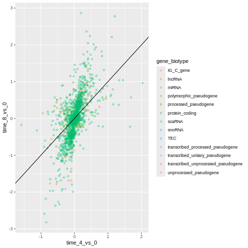
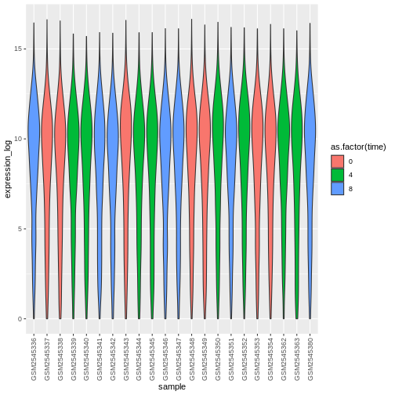

::::::::::::::::::::::::::::::::::::::: objectives

- Produce scatter plots, boxplots, line plots, etc. using ggplot.
- Set universal plot settings.
- Describe what faceting is and apply faceting in ggplot.
- Modify the aesthetics of an existing ggplot plot (including axis labels and color).
- Build complex and customized plots from data in a data frame.

::::::::::::::::::::::::::::::::::::::::::::::::::

:::::::::::::::::::::::::::::::::::::::: questions

- Visualization in R

::::::::::::::::::::::::::::::::::::::::::::::::::


## Data Visualization

We start by loading the required packages. **`ggplot2`** is included in
the **`tidyverse`** package.


```r
library("tidyverse")
```

If not still in the workspace, load the data we saved in the previous
lesson.


```r
rna <- read.csv("data/rnaseq.csv")
```

The [Data Visualization Cheat
Sheet](https://raw.githubusercontent.com/rstudio/cheatsheets/main/data-visualization.pdf)
will cover the basics and more advanced features of `ggplot2` and will
help, in addition to serve as a reminder, getting an overview of the
many data representations available in the package. The following video
tutorials ([part 1](https://www.youtube.com/watch?v=h29g21z0a68) and
[2](https://www.youtube.com/watch?v=0m4yywqNPVY)) by Thomas Lin Pedersen
are also very instructive.

## Plotting with `ggplot2`

`ggplot2` is a plotting package that makes it simple to create complex
plots from data in a data frame. It provides a more programmatic
interface for specifying what variables to plot, how they are displayed,
and general visual properties. The theoretical foundation that supports
the `ggplot2` is the *Grammar of Graphics* (@Wilkinson:2005). Using this
approach, we only need minimal changes if the underlying data change or
if we decide to change from a bar plot to a scatterplot. This helps in
creating publication quality plots with minimal amounts of adjustments
and tweaking.

There is a book about `ggplot2` (@ggplot2book) that provides a good
overview, but it is outdated. The 3rd edition is in preparation and will
be [freely available online](https://ggplot2-book.org/). The `ggplot2`
webpage ([https://ggplot2.tidyverse.org](https://ggplot2.tidyverse.org)) provides ample documentation.

`ggplot2` functions like data in the 'long' format, i.e., a column for
every dimension, and a row for every observation. Well-structured data
will save you lots of time when making figures with `ggplot2`.

ggplot graphics are built step by step by adding new elements. Adding
layers in this fashion allows for extensive flexibility and
customization of plots.

> The idea behind the Grammar of Graphics it is that you can build every
> graph from the same 3 components: (1) a data set, (2) a coordinate system,
> and (3) geoms — i.e. visual marks that represent data points [^three\_comp\_ggplot2]

[^three\_comp\_ggplot2]: Source: [Data Visualization Cheat Sheet](https://raw.githubusercontent.com/rstudio/cheatsheets/main/data-visualization.pdf).

To build a ggplot, we will use the following basic template that can be
used for different types of plots:

```
ggplot(data = <DATA>, mapping = aes(<MAPPINGS>)) +  <GEOM_FUNCTION>()
```

- use the `ggplot()` function and bind the plot to a specific **data
  frame** using the `data` argument


```r
ggplot(data = rna)
```

- define a **mapping** (using the aesthetic (`aes`) function), by
  selecting the variables to be plotted and specifying how to present
  them in the graph, e.g. as x/y positions or characteristics such as
  size, shape, color, etc.


```r
ggplot(data = rna, mapping = aes(x = expression))
```

- add '**geoms**' - geometries, or graphical representations of the
  data in the plot (points, lines, bars). `ggplot2` offers many
  different geoms; we will use some common ones today, including:

  ```
  * `geom_point()` for scatter plots, dot plots, etc.
  * `geom_histogram()` for histograms
  * `geom_boxplot()` for, well, boxplots!
  * `geom_line()` for trend lines, time series, etc.
  ```

To add a geom(etry) to the plot use the `+` operator. Let's use
`geom_histogram()` first:


```r
ggplot(data = rna, mapping = aes(x = expression)) +
  geom_histogram()
```

```{.output}
`stat_bin()` using `bins = 30`. Pick better value with `binwidth`.
```


The `+` in the `ggplot2` package is particularly useful because it
allows you to modify existing `ggplot` objects. This means you can
easily set up plot templates and conveniently explore different types of
plots, so the above plot can also be generated with code like this:


```r
# Assign plot to a variable
rna_plot <- ggplot(data = rna,
                   mapping = aes(x = expression))

# Draw the plot
rna_plot + geom_histogram()
```

:::::::::::::::::::::::::::::::::::::::  challenge

## Challenge

You have probably noticed an automatic message that appears when
drawing the histogram:


```{.output}
`stat_bin()` using `bins = 30`. Pick better value with `binwidth`.
```

Change the arguments `bins` or `binwidth` of `geom_histogram()` to
change the number or width of the bins.

:::::::::::::::  solution

## Solution


```r
# change bins
ggplot(rna, aes(x = expression)) +
    geom_histogram(bins = 15)
```


```r
# change binwidth
ggplot(rna, aes(x = expression)) +
    geom_histogram(binwidth = 2000)
```


:::::::::::::::::::::::::

::::::::::::::::::::::::::::::::::::::::::::::::::

We can observe here that the data are skewed to the right. We can apply
log2 transformation to have a more symmetric distribution. Note that we
add here a small constant value (`+1`) to avoid having `-Inf` values
returned for expression values equal to 0.


```r
rna <- rna %>%
  mutate(expression_log = log2(expression + 1))
```

If we now draw the histogram of the log2-transformed expressions, the
distribution is indeed closer to a normal distribution.


```r
ggplot(rna, aes(x = expression_log)) + geom_histogram()
```

```{.output}
`stat_bin()` using `bins = 30`. Pick better value with `binwidth`.
```


From now on we will work on the log-transformed expression values.

:::::::::::::::::::::::::::::::::::::::  challenge

## Challenge

Another way to visualize this transformation is to consider the scale
of the observations. For example, it may be worth changing the scale
of the axis to better distribute the observations in the space of the
plot. Changing the scale of the axes is done similarly to
adding/modifying other components (i.e., by incrementally adding
commands). Try making this modification:

- Represent the un-transformed expression on the log10 scale; see
  `scale_x_log10()`. Compare it with the previous graph. Why do you
  now have warning messages appearing?

:::::::::::::::  solution

## Solution


```r
ggplot(data = rna,mapping = aes(x = expression))+
  geom_histogram() +
  scale_x_log10()
```

```{.warning}
Warning: Transformation introduced infinite values in continuous x-axis
```

```{.output}
`stat_bin()` using `bins = 30`. Pick better value with `binwidth`.
```

```{.warning}
Warning: Removed 507 rows containing non-finite values (`stat_bin()`).
```


:::::::::::::::::::::::::

::::::::::::::::::::::::::::::::::::::::::::::::::

**Notes**

- Anything you put in the `ggplot()` function can be seen by any geom
  layers that you add (i.e., these are global plot settings). This
  includes the x- and y-axis mapping you set up in `aes()`.
- You can also specify mappings for a given geom independently of the
  mappings defined globally in the `ggplot()` function.
- The `+` sign used to add new layers must be placed at the end of the
  line containing the *previous* layer. If, instead, the `+` sign is
  added at the beginning of the line containing the new layer,
  `ggplot2` will not add the new layer and will return an error
  message.


```r
# This is the correct syntax for adding layers
rna_plot +
  geom_histogram()

# This will not add the new layer and will return an error message
rna_plot
  + geom_histogram()
```

## Building your plots iteratively

We will now draw a scatter plot with two continuous variables and the
`geom_point()` function. This graph will represent the log2 fold changes
of expression comparing time 8 versus time 0, and time 4 versus time 0.
To this end, we first need to compute the means of the log-transformed
expression values by gene and time, then the log fold changes by
subtracting the mean log expressions between time 8 and time 0 and
between time 4 and time 0. Note that we also include here the gene
biotype that we will use later on to represent the genes. We will save
the fold changes in a new data frame called `rna_fc.`


```r
rna_fc <- rna %>% select(gene, time,
                         gene_biotype, expression_log) %>%
  group_by(gene, time, gene_biotype) %>%
  summarize(mean_exp = mean(expression_log)) %>%
  pivot_wider(names_from = time,
              values_from = mean_exp) %>%
  mutate(time_8_vs_0 = `8` - `0`, time_4_vs_0 = `4` - `0`)
```

```{.output}
`summarise()` has grouped output by 'gene', 'time'. You can override using the
`.groups` argument.
```

We can then build a ggplot with the newly created dataset `rna_fc`.
Building plots with `ggplot2` is typically an iterative process. We
start by defining the dataset we'll use, lay out the axes, and choose a
geom:


```r
ggplot(data = rna_fc, mapping = aes(x = time_4_vs_0, y = time_8_vs_0)) +
  geom_point()
```


Then, we start modifying this plot to extract more information from it.
For instance, we can add transparency (`alpha`) to avoid overplotting:


```r
ggplot(data = rna_fc, mapping = aes(x = time_4_vs_0, y = time_8_vs_0)) +
  geom_point(alpha = 0.3)
```


We can also add colors for all the points:


```r
ggplot(data = rna_fc, mapping = aes(x = time_4_vs_0, y = time_8_vs_0)) +
  geom_point(alpha = 0.3, color = "blue")
```


Or to color each gene in the plot differently, you could use a vector as
an input to the argument **color**. `ggplot2` will provide a different
color corresponding to different values in the vector. Here is an
example where we color with `gene_biotype`:


```r
ggplot(data = rna_fc, mapping = aes(x = time_4_vs_0, y = time_8_vs_0)) +
  geom_point(alpha = 0.3, aes(color = gene_biotype))
```


We can also specify the colors directly inside the mapping provided in
the `ggplot()` function. This will be seen by any geom layers and the
mapping will be determined by the x- and y-axis set up in `aes()`.


```r
ggplot(data = rna_fc, mapping = aes(x = time_4_vs_0, y = time_8_vs_0,
                                color = gene_biotype)) +
  geom_point(alpha = 0.3)
```


Finally, we could also add a diagonal line with the `geom_abline()`
function:


```r
ggplot(data = rna_fc, mapping = aes(x = time_4_vs_0, y = time_8_vs_0,
                                color = gene_biotype)) +
  geom_point(alpha = 0.3) +
  geom_abline(intercept = 0)
```


Notice that we can change the geom layer from `geom_point` to
`geom_jitter` and colors will still be determined by `gene_biotype`.


```r
ggplot(data = rna_fc, mapping = aes(x = time_4_vs_0, y = time_8_vs_0,
                                color = gene_biotype)) +
  geom_jitter(alpha = 0.3) +
  geom_abline(intercept = 0)
```




:::::::::::::::::::::::::::::::::::::::  challenge

## Challenge

Scatter plots can be useful exploratory tools for small datasets. For
data sets with large numbers of observations, such as the `rna_fc`
data set, overplotting of points can be a limitation of scatter plots.
One strategy for handling such settings is to use hexagonal binning of
observations. The plot space is tessellated into hexagons. Each
hexagon is assigned a color based on the number of observations that
fall within its boundaries.

- To use hexagonal binning in `ggplot2`, first install the R package
  `hexbin` from CRAN and load it.

- Then use the `geom_hex()` function to produce the hexbin figure.

- What are the relative strengths and weaknesses of a hexagonal bin
  plot compared to a scatter plot? Examine the above scatter plot
  and compare it with the hexagonal bin plot that you created.

:::::::::::::::  solution

## Solution


```r
install.packages("hexbin")
```


```r
library("hexbin")

ggplot(data = rna_fc, mapping = aes(x = time_4_vs_0, y = time_8_vs_0)) +
  geom_hex() +
  geom_abline(intercept = 0)
```


:::::::::::::::::::::::::

::::::::::::::::::::::::::::::::::::::::::::::::::

:::::::::::::::::::::::::::::::::::::::  challenge

## Challenge

Use what you just learned to create a scatter plot of `expression_log`
over `sample` from the `rna` dataset with the time showing in
different colors. Is this a good way to show this type of data?

:::::::::::::::  solution

## Solution


```r
ggplot(data = rna, mapping = aes(y = expression_log, x = sample)) +
    geom_point(aes(color = time))
```


:::::::::::::::::::::::::

::::::::::::::::::::::::::::::::::::::::::::::::::

## Boxplot

We can use boxplots to visualize the distribution of gene expressions
within each sample:


```r
ggplot(data = rna,
         mapping = aes(y = expression_log, x = sample)) +
  geom_boxplot()
```


By adding points to boxplot, we can have a better idea of the number of
measurements and of their distribution:


```r
ggplot(data = rna,
         mapping = aes(y = expression_log, x = sample)) +
  geom_jitter(alpha = 0.2, color = "tomato") +
  geom_boxplot(alpha = 0)
```


:::::::::::::::::::::::::::::::::::::::  challenge

## Challenge

Note how the boxplot layer is in front of the jitter layer? What do
you need to change in the code to put the boxplot below the points?

:::::::::::::::  solution

## Solution

We should switch the order of these two geoms:


```r
ggplot(data = rna,
         mapping = aes(y = expression_log, x = sample)) +
  geom_boxplot(alpha = 0) +
  geom_jitter(alpha = 0.2, color = "tomato")
```


:::::::::::::::::::::::::

::::::::::::::::::::::::::::::::::::::::::::::::::

You may notice that the values on the x-axis are still not properly
readable. Let's change the orientation of the labels and adjust them
vertically and horizontally so they don't overlap. You can use a
90-degree angle, or experiment to find the appropriate angle for
diagonally oriented labels:


```r
ggplot(data = rna,
         mapping = aes(y = expression_log, x = sample)) +
  geom_jitter(alpha = 0.2, color = "tomato") +
  geom_boxplot(alpha = 0) +
  theme(axis.text.x = element_text(angle = 90,  hjust = 0.5, vjust = 0.5))
```


:::::::::::::::::::::::::::::::::::::::  challenge

## Challenge

Add color to the data points on your boxplot according to the duration
of the infection (`time`).

*Hint:* Check the class for `time`. Consider changing the class of
`time` from integer to factor directly in the ggplot mapping. Why does
this change how R makes the graph?

:::::::::::::::  solution

## Solution


```r
# time as integer
ggplot(data = rna,
         mapping = aes(y = expression_log,
                       x = sample)) +
  geom_jitter(alpha = 0.2, aes(color = time)) +
  geom_boxplot(alpha = 0) +
  theme(axis.text.x = element_text(angle = 90,  hjust = 0.5, vjust = 0.5))
```


```r
# time as factor
ggplot(data = rna,
         mapping = aes(y = expression_log,
                       x = sample)) +
  geom_jitter(alpha = 0.2, aes(color = as.factor(time))) +
  geom_boxplot(alpha = 0) +
  theme(axis.text.x = element_text(angle = 90,  hjust = 0.5, vjust = 0.5))
```


:::::::::::::::::::::::::

::::::::::::::::::::::::::::::::::::::::::::::::::

:::::::::::::::::::::::::::::::::::::::  challenge

## Challenge

Boxplots are useful summaries, but hide the *shape* of the
distribution. For example, if the distribution is bimodal, we would
not see it in a boxplot. An alternative to the boxplot is the violin
plot, where the shape (of the density of points) is drawn.

- Replace the box plot with a violin plot; see `geom_violin()`. Fill
  in the violins according to the time with the argument `fill`.

:::::::::::::::  solution

## Solution


```r
ggplot(data = rna,
         mapping = aes(y = expression_log, x = sample)) +
  geom_violin(aes(fill = as.factor(time))) +
  theme(axis.text.x = element_text(angle = 90,  hjust = 0.5, vjust = 0.5))
```



:::::::::::::::::::::::::

::::::::::::::::::::::::::::::::::::::::::::::::::

:::::::::::::::::::::::::::::::::::::::  challenge

## Challenge

- Modify the violin plot to fill in the violins by `sex`.

:::::::::::::::  solution

## Solution


```r
ggplot(data = rna,
         mapping = aes(y = expression_log, x = sample)) +
  geom_violin(aes(fill = sex)) +
  theme(axis.text.x = element_text(angle = 90,  hjust = 0.5, vjust = 0.5))
```


:::::::::::::::::::::::::

::::::::::::::::::::::::::::::::::::::::::::::::::

## Line plots

Let's calculate the mean expression per duration of the infection for
the 10 genes having the highest log fold changes comparing time 8 versus
time 0. First, we need to select the genes and create a subset of `rna`
called `sub_rna` containing the 10 selected genes, then we need to group
the data and calculate the mean gene expression within each group:


```r
rna_fc <- rna_fc %>% arrange(desc(time_8_vs_0))

genes_selected <- rna_fc$gene[1:10]

sub_rna <- rna %>%
    filter(gene %in% genes_selected)

mean_exp_by_time <- sub_rna %>%
  group_by(gene,time) %>%
    summarize(mean_exp = mean(expression_log))
```

```{.output}
`summarise()` has grouped output by 'gene'. You can override using the
`.groups` argument.
```

```r
mean_exp_by_time
```

```{.output}
# A tibble: 30 × 3
# Groups:   gene [10]
   gene   time mean_exp
   <chr> <int>    <dbl>
 1 Acr       0     5.07
 2 Acr       4     5.54
 3 Acr       8     7.31
 4 Aipl1     0     3.70
 5 Aipl1     4     3.89
 6 Aipl1     8     6.56
 7 Bst1      0     3.20
 8 Bst1      4     3.77
 9 Bst1      8     5.22
10 Chil3     0     4.00
# ℹ 20 more rows
```

We can build the line plot with duration of the infection on the x-axis
and the mean expression on the y-axis:


```r
ggplot(data = mean_exp_by_time, mapping = aes(x = time, y = mean_exp)) +
  geom_line()
```


Unfortunately, this does not work because we plotted data for all the
genes together. We need to tell ggplot to draw a line for each gene by
modifying the aesthetic function to include `group = gene`:


```r
ggplot(data = mean_exp_by_time,
       mapping = aes(x = time, y = mean_exp, group = gene)) +
  geom_line()
```


We will be able to distinguish genes in the plot if we add colors (using
`color` also automatically groups the data):


```r
ggplot(data = mean_exp_by_time,
       mapping = aes(x = time, y = mean_exp, color = gene)) +
  geom_line()
```


## Faceting

`ggplot2` has a special technique called *faceting* that allows the user
to split one plot into multiple (sub) plots based on a factor included
in the dataset. These different subplots inherit the same properties
(axes limits, ticks, ...) to facilitate their direct comparison. We will
use it to make a line plot across time for each gene:


```r
ggplot(data = mean_exp_by_time,
       mapping = aes(x = time, y = mean_exp)) + geom_line() +
  facet_wrap(~ gene)
```


Here both x- and y-axis have the same scale for all the subplots. You
can change this default behavior by modifying `scales` in order to allow
a free scale for the y-axis:


```r
ggplot(data = mean_exp_by_time,
       mapping = aes(x = time, y = mean_exp)) +
  geom_line() +
  facet_wrap(~ gene, scales = "free_y")
```


Now we would like to split the line in each plot by the sex of the mice.
To do that we need to calculate the mean expression in the data frame
grouped by `gene`, `time`, and `sex`:


```r
mean_exp_by_time_sex <- sub_rna %>%
  group_by(gene, time, sex) %>%
    summarize(mean_exp = mean(expression_log))
```

```{.output}
`summarise()` has grouped output by 'gene', 'time'. You can override using the
`.groups` argument.
```

```r
mean_exp_by_time_sex
```

```{.output}
# A tibble: 60 × 4
# Groups:   gene, time [30]
   gene   time sex    mean_exp
   <chr> <int> <chr>     <dbl>
 1 Acr       0 Female     5.13
 2 Acr       0 Male       5.00
 3 Acr       4 Female     5.93
 4 Acr       4 Male       5.15
 5 Acr       8 Female     7.27
 6 Acr       8 Male       7.36
 7 Aipl1     0 Female     3.67
 8 Aipl1     0 Male       3.73
 9 Aipl1     4 Female     4.07
10 Aipl1     4 Male       3.72
# ℹ 50 more rows
```

We can now make the faceted plot by splitting further by sex using
`color` (within a single plot):


```r
ggplot(data = mean_exp_by_time_sex,
       mapping = aes(x = time, y = mean_exp, color = sex)) +
  geom_line() +
  facet_wrap(~ gene, scales = "free_y")
```


Usually plots with white background look more readable when printed. We
can set the background to white using the function `theme_bw()`.
Additionally, we can remove the grid:


```r
ggplot(data = mean_exp_by_time_sex,
       mapping = aes(x = time, y = mean_exp, color = sex)) +
  geom_line() +
  facet_wrap(~ gene, scales = "free_y") +
  theme_bw() +
  theme(panel.grid = element_blank())
```


:::::::::::::::::::::::::::::::::::::::  challenge

## Challenge

Use what you just learned to create a plot that depicts how the
average expression of each chromosome changes through the duration of
infection.

:::::::::::::::  solution

## Solution


```r
mean_exp_by_chromosome <- rna %>%
  group_by(chromosome_name, time) %>%
  summarize(mean_exp = mean(expression_log))
```

```{.output}
`summarise()` has grouped output by 'chromosome_name'. You can override using
the `.groups` argument.
```

```r
ggplot(data = mean_exp_by_chromosome, mapping = aes(x = time,
                                y = mean_exp)) +
  geom_line() +
  facet_wrap(~ chromosome_name, scales = "free_y")
```


:::::::::::::::::::::::::

::::::::::::::::::::::::::::::::::::::::::::::::::

The `facet_wrap` geometry extracts plots into an arbitrary number of
dimensions to allow them to cleanly fit on one page. On the other hand,
the `facet_grid` geometry allows you to explicitly specify how you want
your plots to be arranged via formula notation (`rows ~ columns`; a `.`
can be used as a placeholder that indicates only one row or column).

Let's modify the previous plot to compare how the mean gene expression
of males and females has changed through time:


```r
# One column, facet by rows
ggplot(data = mean_exp_by_time_sex,
       mapping = aes(x = time, y = mean_exp, color = gene)) +
  geom_line() +
  facet_grid(sex ~ .)
```


```r
# One row, facet by column
ggplot(data = mean_exp_by_time_sex,
       mapping = aes(x = time, y = mean_exp, color = gene)) +
  geom_line() +
  facet_grid(. ~ sex)
```


## `ggplot2` themes

In addition to `theme_bw()`, which changes the plot background to white,
`ggplot2` comes with several other themes which can be useful to quickly
change the look of your visualization. The complete list of themes is
available at [https://ggplot2.tidyverse.org/reference/ggtheme.html](https://ggplot2.tidyverse.org/reference/ggtheme.html).
`theme_minimal()` and `theme_light()` are popular, and `theme_void()`
can be useful as a starting point to create a new hand-crafted theme.

The [ggthemes](https://jrnold.github.io/ggthemes/reference/index.html)
package provides a wide variety of options (including an Excel 2003
theme). The [`ggplot2` extensions
website](https://exts.ggplot2.tidyverse.org/) provides a list of
packages that extend the capabilities of `ggplot2`, including additional
themes.

## Customisation

Let's come back to the faceted plot of mean expression by time and gene,
colored by sex.

Take a look at the [`ggplot2` cheat
sheet](https://raw.githubusercontent.com/rstudio/cheatsheets/main/data-visualization.pdf),
and think of ways you could improve the plot.

Now, we can change names of axes to something more informative than
'time' and 'mean\_exp', and add a title to the figure:


```r
ggplot(data = mean_exp_by_time_sex,
       mapping = aes(x = time, y = mean_exp, color = sex)) +
  geom_line() +
  facet_wrap(~ gene, scales = "free_y") +
  theme_bw() +
  theme(panel.grid = element_blank()) +
  labs(title = "Mean gene expression by duration of the infection",
       x = "Duration of the infection (in days)",
       y = "Mean gene expression")
```


The axes have more informative names, but their readability can be
improved by increasing the font size:


```r
ggplot(data = mean_exp_by_time_sex,
       mapping = aes(x = time, y = mean_exp, color = sex)) +
  geom_line() +
  facet_wrap(~ gene, scales = "free_y") +
  theme_bw() +
  theme(panel.grid = element_blank()) +
  labs(title = "Mean gene expression by duration of the infection",
       x = "Duration of the infection (in days)",
       y = "Mean gene expression")  +
  theme(text = element_text(size = 16))
```


Note that it is also possible to change the fonts of your plots. If you
are on Windows, you may have to install the [**`extrafont`**
package](https://cran.r-project.org/web/packages/extrafont/index.html).

We can further customize the color of x- and y-axis text, the color of
the grid, etc. We can also for example move the legend to the top by
setting `legend.position` to `"top"`.


```r
ggplot(data = mean_exp_by_time_sex,
       mapping = aes(x = time, y = mean_exp, color = sex)) +
  geom_line() +
  facet_wrap(~ gene, scales = "free_y") +
  theme_bw() +
  theme(panel.grid = element_blank()) +
  labs(title = "Mean gene expression by duration of the infection",
       x = "Duration of the infection (in days)",
       y = "Mean gene expression")  +
  theme(text = element_text(size = 16),
        axis.text.x = element_text(colour = "royalblue4", size = 12),
        axis.text.y = element_text(colour = "royalblue4", size = 12),
        panel.grid = element_line(colour="lightsteelblue1"),
        legend.position = "top")
```


If you like the changes you created better than the default theme, you
can save them as an object to be able to easily apply them to other
plots you may create. Here is an example with the histogram we have
previously created.


```r
blue_theme <- theme(axis.text.x = element_text(colour = "royalblue4",
                                               size = 12),
                    axis.text.y = element_text(colour = "royalblue4",
                                               size = 12),
                    text = element_text(size = 16),
                    panel.grid = element_line(colour="lightsteelblue1"))

ggplot(rna, aes(x = expression_log)) +
  geom_histogram(bins = 20) +
    blue_theme
```


:::::::::::::::::::::::::::::::::::::::  challenge

## Challenge

With all of this information in hand, please take another five minutes
to either improve one of the plots generated in this exercise or
create a beautiful graph of your own. Use the RStudio [`ggplot2` cheat
sheet](https://github.com/rstudio/cheatsheets/raw/master/data-visualization-2.1.pdf)
for inspiration. Here are some ideas:

- See if you can change the thickness of the lines.
- Can you find a way to change the name of the legend? What about
  its labels? (hint: look for a ggplot function starting with
  `scale_`)
- Try using a different color palette or manually specifying the
  colors for the lines (see
  [http://www.cookbook-r.com/Graphs/Colors\_(ggplot2)/](https://www.cookbook-r.com/Graphs/Colors_\(ggplot2\)/)).

:::::::::::::::  solution

## Solution

For example, based on this plot:


```r
ggplot(data = mean_exp_by_time_sex,
       mapping = aes(x = time, y = mean_exp, color = sex)) +
  geom_line() +
  facet_wrap(~ gene, scales = "free_y") +
  theme_bw() +
  theme(panel.grid = element_blank())
```


We can customize it the following ways:


```r
# change the thickness of the lines
ggplot(data = mean_exp_by_time_sex,
       mapping = aes(x = time, y = mean_exp, color = sex)) +
  geom_line(size=1.5) +
  facet_wrap(~ gene, scales = "free_y") +
  theme_bw() +
  theme(panel.grid = element_blank())
```

```{.warning}
Warning: Using `size` aesthetic for lines was deprecated in ggplot2 3.4.0.
ℹ Please use `linewidth` instead.
This warning is displayed once every 8 hours.
Call `lifecycle::last_lifecycle_warnings()` to see where this warning was
generated.
```


```r
# change the name of the legend and the labels
ggplot(data = mean_exp_by_time_sex,
       mapping = aes(x = time, y = mean_exp, color = sex)) +
  geom_line() +
  facet_wrap(~ gene, scales = "free_y") +
  theme_bw() +
  theme(panel.grid = element_blank()) +
  scale_color_discrete(name = "Gender", labels = c("F", "M"))
```


```r
# using a different color palette
ggplot(data = mean_exp_by_time_sex,
       mapping = aes(x = time, y = mean_exp, color = sex)) +
  geom_line() +
  facet_wrap(~ gene, scales = "free_y") +
  theme_bw() +
  theme(panel.grid = element_blank()) +
  scale_color_brewer(name = "Gender", labels = c("F", "M"), palette = "Dark2")
```


```r
# manually specifying the colors
ggplot(data = mean_exp_by_time_sex,
       mapping = aes(x = time, y = mean_exp, color = sex)) +
  geom_line() +
  facet_wrap(~ gene, scales = "free_y") +
  theme_bw() +
  theme(panel.grid = element_blank()) +
  scale_color_manual(name = "Gender",  labels = c("F", "M"),
                     values = c("royalblue", "deeppink"))
```


:::::::::::::::::::::::::

::::::::::::::::::::::::::::::::::::::::::::::::::

## Composing plots

Faceting is a great tool for splitting one plot into multiple subplots,
but sometimes you may want to produce a single figure that contains
multiple independent plots, i.e. plots that are based on different
variables or even different data frames.

Let's start by creating the two plots that we want to arrange next to
each other:

The first graph counts the number of unique genes per chromosome. We
first need to reorder the levels of `chromosome_name` and filter the
unique genes per chromosome. We also change the scale of the y-axis to a
log10 scale for better readability.


```r
rna$chromosome_name <- factor(rna$chromosome_name,
                               levels = c(1:19,"X","Y"))

count_gene_chromosome <- rna %>% select(chromosome_name, gene) %>%
  distinct() %>% ggplot() +
  geom_bar(aes(x = chromosome_name), fill = "seagreen",
           position = "dodge", stat = "count") +
  labs(y = "log10(n genes)", x = "chromosome") +
  scale_y_log10()

count_gene_chromosome
```


Below, we also remove the legend altogether by setting the
`legend.position` to `"none"`.


```r
exp_boxplot_sex <- ggplot(rna, aes(y=expression_log, x = as.factor(time),
                 color=sex)) +
   geom_boxplot(alpha = 0) +
  labs(y = "Mean gene exp",
       x = "time") + theme(legend.position = "none")

exp_boxplot_sex
```


The [**patchwork**](https://github.com/thomasp85/patchwork) package
provides an elegant approach to combining figures using the `+` to
arrange figures (typically side by side). More specifically the `|`
explicitly arranges them side by side and `/` stacks them on top of each
other.


```r
install.packages("patchwork")
```


```r
library("patchwork")
count_gene_chromosome + exp_boxplot_sex
```


```r
## or count_gene_chromosome | exp_boxplot_sex
```


```r
count_gene_chromosome / exp_boxplot_sex
```


We can combine further control the layout of the final composition with
`plot_layout` to create more complex layouts:


```r
count_gene_chromosome + exp_boxplot_sex + plot_layout(ncol = 1)
```


```r
count_gene_chromosome +
 (count_gene_chromosome + exp_boxplot_sex) +
 exp_boxplot_sex +
 plot_layout(ncol = 1)
```


The last plot can also be created using the `|` and `/` composers:


```r
count_gene_chromosome /
 (count_gene_chromosome | exp_boxplot_sex) /
 exp_boxplot_sex
```


Learn more about `patchwork` on its
[webpage](https://patchwork.data-imaginist.com/) or in this
[video](https://www.youtube.com/watch?v=0m4yywqNPVY).

Another option is the **`gridExtra`** package that allows to combine
separate ggplots into a single figure using `grid.arrange()`:


```r
install.packages("gridExtra")
```


```r
library("gridExtra")
grid.arrange(count_gene_chromosome, exp_boxplot_sex, ncol = 2)
```


In addition to the `ncol` and `nrow` arguments, used to make simple
arrangements, there are tools for [constructing more complex
layouts](https://cran.r-project.org/web/packages/gridExtra/vignettes/arrangeGrob.html).

## Exporting plots

After creating your plot, you can save it to a file in your favorite
format. The Export tab in the **Plot** pane in RStudio will save your
plots at low resolution, which will not be accepted by many journals and
will not scale well for posters.

Instead, use the `ggsave()` function, which allows you easily change the
dimension and resolution of your plot by adjusting the appropriate
arguments (`width`, `height` and `dpi`).

Make sure you have the `fig_output/` folder in your working directory.


```r
my_plot <- ggplot(data = mean_exp_by_time_sex,
       mapping = aes(x = time, y = mean_exp, color = sex)) +
  geom_line() +
  facet_wrap(~ gene, scales = "free_y") +
  labs(title = "Mean gene expression by duration of the infection",
         x = "Duration of the infection (in days)",
         y = "Mean gene expression") +
  guides(color=guide_legend(title="Gender")) +
  theme_bw() +
  theme(axis.text.x = element_text(colour = "royalblue4", size = 12),
        axis.text.y = element_text(colour = "royalblue4", size = 12),
        text = element_text(size = 16),
        panel.grid = element_line(colour="lightsteelblue1"),
        legend.position = "top")
ggsave("fig_output/mean_exp_by_time_sex.png", my_plot, width = 15,
       height = 10)

# This also works for grid.arrange() plots
combo_plot <- grid.arrange(count_gene_chromosome, exp_boxplot_sex,
                           ncol = 2, widths = c(4, 6))
ggsave("fig_output/combo_plot_chromosome_sex.png", combo_plot,
       width = 10, dpi = 300)
```

Note: The parameters `width` and `height` also determine the font size
in the saved plot.


## Other packages for visualisation

`ggplot2` is a very powerful package that fits very nicely in our *tidy
data* and *tidy tools* pipeline. There are other visualization packages
in R that shouldn't be ignored.

### Base graphics

The default graphics system that comes with R, often called *base R
graphics* is simple and fast. It is based on the *painter's or canvas
model*, where different output are directly overlaid on top of each
other (see figure @ref(fig:paintermodel)). This is a fundamental
difference with `ggplot2` (and with `lattice`, described below), that
returns dedicated objects, that are rendered on screen or in a file, and
that can even be updated.


```r
par(mfrow = c(1, 3))
plot(1:20, main = "First layer, produced with plot(1:20)")

plot(1:20, main = "A horizontal red line, added with abline(h = 10)")
abline(h = 10, col = "red")

plot(1:20, main = "A rectangle, added with rect(5, 5, 15, 15)")
abline(h = 10, col = "red")
rect(5, 5, 15, 15, lwd = 3)
```

<div class="figure" style="text-align: center">

<p class="caption">Successive layers added on top of each other.</p>
</div>

Another main difference is that base graphics' plotting function try to
do *the right* thing based on their input type, i.e. they will adapt
their behaviour based on the class of their input. This is again very
different from what we have in `ggplot2`, that only accepts dataframes
as input, and that requires plots to be constructed bit by bit.


```r
par(mfrow = c(2, 2))
boxplot(rnorm(100),
        main = "Boxplot of rnorm(100)")
boxplot(matrix(rnorm(100), ncol = 10),
        main = "Boxplot of matrix(rnorm(100), ncol = 10)")
hist(rnorm(100))
hist(matrix(rnorm(100), ncol = 10))
```

<div class="figure" style="text-align: center">

<p class="caption">Plotting boxplots (top) and histograms (bottom) vectors (left) or a matrices (right).</p>
</div>

The out-of-the-box approach in base graphics can be very efficient for
simple, standard figures, that can be produced very quickly with a
single line of code and a single function such as `plot`, or `hist`, or
`boxplot`, ... The defaults are however not always the most appealing
and tuning of figures, especially when they become more complex (for
example to produce facets), can become lengthy and cumbersome.

### The lattice package

The **`lattice`** package is similar to `ggplot2` in that is uses
dataframes as input, returns graphical objects and supports faceting.
`lattice` however isn't based on the grammar of graphics and has a more
convoluted interface.

A good reference for the `lattice` package is @latticebook.

:::::::::::::::::::::::::::::::::::::::: keypoints

- Visualization in R

::::::::::::::::::::::::::::::::::::::::::::::::::
