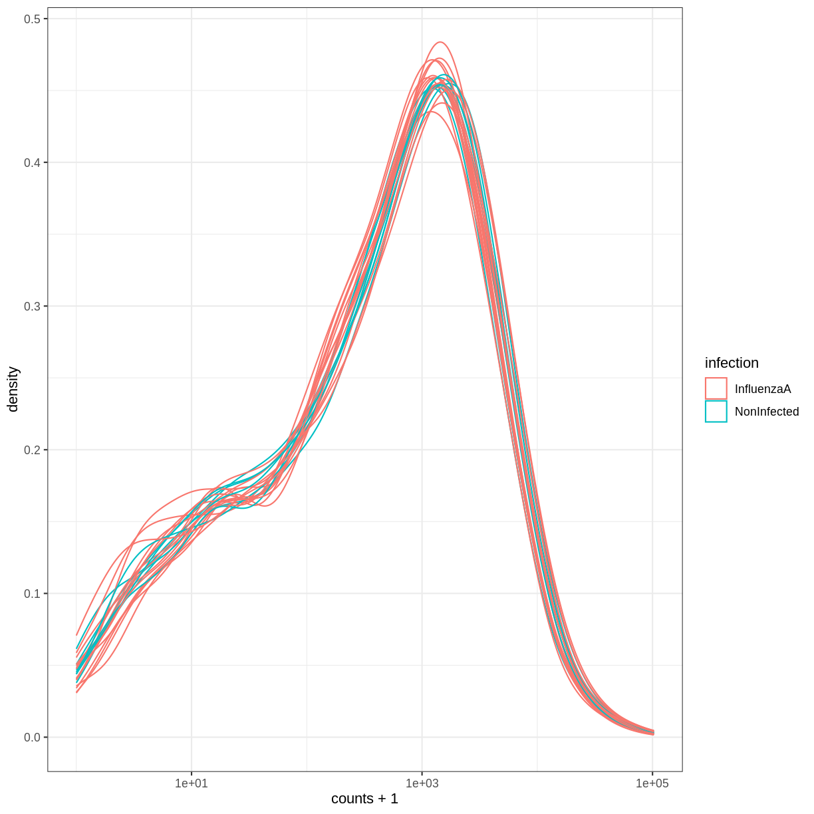

---
# Please do not edit this file directly; it is auto generated.
# Instead, please edit 60-next-steps.md in _episodes_rmd/
source: Rmd
title: "Next steps"
teaching: 45
exercises: 45
questions:
- "SummarizedExperiment"
objectives:
- Introduce the notion of data containers
- Give an overview of the `SummarizedExperiment`, extensively used in omics analyses
keypoints:
- "Tabular data in R"
---

## Next steps

Data in bioinformatics is often complex.
To deal with this, developers define specialised
data containers (termed classes) that match the properties of the
data they need to handle.

This aspect is central to the **Bioconductor**[^Bioconductor] project which
uses the same **core data infrastructure** across packages. This certainly contributed
to Bioconductor's success. Bioconductor package developers are advised to make
use of existing infrastructure to provide coherence, interoperability, and stability to
the project as a whole.

[^Bioconductor]: The [Bioconductor](http://www.bioconductor.org) was initiated by Robert Gentleman, one of the two creators of the R language. Bioconductor provides tools dedicated to omics data analysis. Bioconductor uses the R statistical programming language and is open source and open development.

To illustrate such an omics data container, we'll present the `SummarizedExperiment`
class.

## SummarizedExperiment

The figure below represents the anatomy of the SummarizedExperiment class.

Objects of the class SummarizedExperiment contain :

- **One (or more) assay(s)** containing the quantitative omics data
  (expression data), stored as a matrix-like object. Features (genes,
  transcripts, proteins, ...) are defined along the rows, and samples
  along the columns.

- A **sample metadata** slot containing sample co-variates, stored as a
  data frame. Rows from this table represent samples (rows match exactly the
  columns of the expression data).

- A **feature metadata** slot containing feature co-variates, stored as
  a data frame. The rows of this data frame match exactly the rows of the
  expression data.

The coordinated nature of the SummarizedExperiment guarantees that
during data manipulation, the
dimensions of the different slots will always match (i.e the columns
in the expression data and then rows in the sample metadata, as well
as the rows in the expression data and feature metadata) during data
manipulation. For example, if we had to exclude one sample from the assay,
it would be automatically removed from the sample metadata in the same operation.

The metadata slots can grow additional co-variates
(columns) without affecting the other structures.

### Creating a SummarizedExperiment

In order to create a `SummarizedExperiment`, we will first create the individual 
components (the count matrix, the sample and gene metadata). 

~~~
rna <- read_csv("data/rnaseq.csv")

## count matrix
counts <- rna %>%
  select(gene, sample, expression) %>%
  pivot_wider(names_from = sample,
              values_from = expression)

## convert to matrix and set row names
count_matrix <- counts %>% select(-gene) %>% as.matrix()
rownames(count_matrix) <- counts$gene

## sample annotation
sample_metadata <- rna %>%
  select(sample, organism, age, sex, infection, strain, time, tissue, mouse)

## remove redundancy
sample_metadata <- unique(sample_metadata)

## gene annotation
gene_metadata <- rna %>%
  select(gene, ENTREZID, product, ensembl_gene_id, external_synonym, 
         chromosome_name, gene_biotype, phenotype_description, 
         hsapiens_homolog_associated_gene_name)

# remove redundancy
gene_metadata <- unique(gene_metadata)
~~~
{: .language-r}

To summarize, we now have:

- **An expression matrix**

~~~
count_matrix[1:5, ]
~~~
{: .language-r}

~~~
        GSM2545336 GSM2545337 GSM2545338 GSM2545339 GSM2545340 GSM2545341
Asl           1170        361        400        586        626        988
Apod         36194      10347       9173      10620      13021      29594
Cyp2d22       4060       1616       1603       1901       2171       3349
Klk6           287        629        641        578        448        195
Fcrls           85        233        244        237        180         38
        GSM2545342 GSM2545343 GSM2545344 GSM2545345 GSM2545346 GSM2545347
Asl            836        535        586        597        938       1035
Apod         24959      13668      13230      15868      27769      34301
Cyp2d22       3122       2008       2254       2277       2985       3452
Klk6           186       1101        537        567        327        233
Fcrls           68        375        199        177         89         67
        GSM2545348 GSM2545349 GSM2545350 GSM2545351 GSM2545352 GSM2545353
Asl            494        481        666        937        803        541
Apod         11258      11812      15816      29242      20415      13682
Cyp2d22       1883       2014       2417       3678       2920       2216
Klk6           742        881        828        250        798        710
Fcrls          300        233        231         81        303        285
        GSM2545354 GSM2545362 GSM2545363 GSM2545380
Asl            473        748        576       1192
Apod         11088      15916      11166      38148
Cyp2d22       1821       2842       2011       4019
Klk6           894        501        598        259
Fcrls          248        179        184         68
~~~
{: .output}

~~~
dim(count_matrix)
~~~
{: .language-r}

~~~
[1] 1474   22
~~~
{: .output}

- **A table describing the samples**

~~~
sample_metadata
~~~
{: .language-r}

~~~
# A tibble: 22 × 9
   sample     organism       age sex    infection   strain   time tissue   mouse
   <chr>      <chr>        <dbl> <chr>  <chr>       <chr>   <dbl> <chr>    <dbl>
 1 GSM2545336 Mus musculus     8 Female InfluenzaA  C57BL/6     8 Cerebel…    14
 2 GSM2545337 Mus musculus     8 Female NonInfected C57BL/6     0 Cerebel…     9
 3 GSM2545338 Mus musculus     8 Female NonInfected C57BL/6     0 Cerebel…    10
 4 GSM2545339 Mus musculus     8 Female InfluenzaA  C57BL/6     4 Cerebel…    15
 5 GSM2545340 Mus musculus     8 Male   InfluenzaA  C57BL/6     4 Cerebel…    18
 6 GSM2545341 Mus musculus     8 Male   InfluenzaA  C57BL/6     8 Cerebel…     6
 7 GSM2545342 Mus musculus     8 Female InfluenzaA  C57BL/6     8 Cerebel…     5
 8 GSM2545343 Mus musculus     8 Male   NonInfected C57BL/6     0 Cerebel…    11
 9 GSM2545344 Mus musculus     8 Female InfluenzaA  C57BL/6     4 Cerebel…    22
10 GSM2545345 Mus musculus     8 Male   InfluenzaA  C57BL/6     4 Cerebel…    13
# … with 12 more rows
~~~
{: .output}

- **A table describing the genes**

~~~
gene_metadata
~~~
{: .language-r}

~~~
# A tibble: 1,474 × 9
   gene    ENTREZID product      ensem…¹ exter…² chrom…³ gene_…⁴ pheno…⁵ hsapi…⁶
   <chr>      <dbl> <chr>        <chr>   <chr>   <chr>   <chr>   <chr>   <chr>  
 1 Asl       109900 argininosuc… ENSMUS… 251000… 5       protei… abnorm… ASL    
 2 Apod       11815 apolipoprot… ENSMUS… <NA>    16      protei… abnorm… APOD   
 3 Cyp2d22    56448 cytochrome … ENSMUS… 2D22    15      protei… abnorm… CYP2D6 
 4 Klk6       19144 kallikrein … ENSMUS… Bssp    7       protei… abnorm… KLK6   
 5 Fcrls      80891 Fc receptor… ENSMUS… 281043… 3       protei… decrea… FCRL2  
 6 Slc2a4     20528 solute carr… ENSMUS… Glut-4  11      protei… abnorm… SLC2A4 
 7 Exd2       97827 exonuclease… ENSMUS… 493053… 12      protei… <NA>    EXD2   
 8 Gjc2      118454 gap junctio… ENSMUS… B23038… 11      protei… Purkin… GJC2   
 9 Plp1       18823 proteolipid… ENSMUS… DM20    X       protei… abnorm… PLP1   
10 Gnb4       14696 guanine nuc… ENSMUS… 672045… 3       protei… decrea… GNB4   
# … with 1,464 more rows, and abbreviated variable names ¹​ensembl_gene_id,
#   ²​external_synonym, ³​chromosome_name, ⁴​gene_biotype, ⁵​phenotype_description,
#   ⁶​hsapiens_homolog_associated_gene_name
~~~
{: .output}

We will create a `SummarizedExperiment` from these tables:

- The count matrix that will be used as the **`assay`**

- The table describing the samples will be used as the **sample metadata** slot

- The table describing the genes will be used as the **features metadata** slot

To do this we can put the different parts together using the
`SummarizedExperiment` constructor:

~~~
#BiocManager::install("SummarizedExperiment")
library("SummarizedExperiment")
~~~
{: .language-r}

First, we make sure that the samples are in the same order in the count 
matrix and the sample annotation, and the same for the genes in the count matrix 
and the gene annotation.

~~~
stopifnot(rownames(count_matrix) == gene_metadata$gene)
stopifnot(colnames(count_matrix) == sample_metadata$sample)
~~~
{: .language-r}

~~~
se <- SummarizedExperiment(assays = list(counts = count_matrix),
                           colData = sample_metadata,
                           rowData = gene_metadata)
se
~~~
{: .language-r}

~~~
class: SummarizedExperiment 
dim: 1474 22 
metadata(0):
assays(1): counts
rownames(1474): Asl Apod ... Lmx1a Pbx1
rowData names(9): gene ENTREZID ... phenotype_description
  hsapiens_homolog_associated_gene_name
colnames(22): GSM2545336 GSM2545337 ... GSM2545363 GSM2545380
colData names(9): sample organism ... tissue mouse
~~~
{: .output}

### Saving data

Exporting data to a spreadsheet, as we did in a previous episode, 
has several limitations, such as those
described in the first chapter (possible inconsistencies with
`,` and `.` for decimal separators and lack of variable type
definitions). Furthermore, exporting data to a spreadsheet is only
relevant for rectangular data such as dataframes and matrices.

A more general way to save data, that is specific to R and is
guaranteed to work on any operating system, is to use the `saveRDS`
function. Saving objects like this will generate a binary representation
on disk (using the `rds` file extension here), which can be loaded back into R 
using the `readRDS` function.

~~~
saveRDS(se, file = "data_output/se.rds")
rm(se)
se <- readRDS("data_output/se.rds")
head(se)
~~~
{: .language-r}

To conclude, when it comes to saving data from R that will be loaded
again in R, saving and loading with `saveRDS` and `readRDS` is the 
preferred approach. If tabular data need to be shared with somebody that 
is not using R, then exporting to a text-based spreadsheet is a good alternative.

Using this data structure, we can access the expression matrix with
the `assay` function:

~~~
head(assay(se))
~~~
{: .language-r}

~~~
        GSM2545336 GSM2545337 GSM2545338 GSM2545339 GSM2545340 GSM2545341
Asl           1170        361        400        586        626        988
Apod         36194      10347       9173      10620      13021      29594
Cyp2d22       4060       1616       1603       1901       2171       3349
Klk6           287        629        641        578        448        195
Fcrls           85        233        244        237        180         38
Slc2a4         782        231        248        265        313        786
        GSM2545342 GSM2545343 GSM2545344 GSM2545345 GSM2545346 GSM2545347
Asl            836        535        586        597        938       1035
Apod         24959      13668      13230      15868      27769      34301
Cyp2d22       3122       2008       2254       2277       2985       3452
Klk6           186       1101        537        567        327        233
Fcrls           68        375        199        177         89         67
Slc2a4         528        249        266        357        654        693
        GSM2545348 GSM2545349 GSM2545350 GSM2545351 GSM2545352 GSM2545353
Asl            494        481        666        937        803        541
Apod         11258      11812      15816      29242      20415      13682
Cyp2d22       1883       2014       2417       3678       2920       2216
Klk6           742        881        828        250        798        710
Fcrls          300        233        231         81        303        285
Slc2a4         271        304        349        715        513        320
        GSM2545354 GSM2545362 GSM2545363 GSM2545380
Asl            473        748        576       1192
Apod         11088      15916      11166      38148
Cyp2d22       1821       2842       2011       4019
Klk6           894        501        598        259
Fcrls          248        179        184         68
Slc2a4         248        350        317        796
~~~
{: .output}

~~~
dim(assay(se))
~~~
{: .language-r}

~~~
[1] 1474   22
~~~
{: .output}

We can access the sample metadata using the `colData` function:

~~~
colData(se)
~~~
{: .language-r}

~~~
DataFrame with 22 rows and 9 columns
                sample     organism       age         sex   infection
           <character>  <character> <numeric> <character> <character>
GSM2545336  GSM2545336 Mus musculus         8      Female  InfluenzaA
GSM2545337  GSM2545337 Mus musculus         8      Female NonInfected
GSM2545338  GSM2545338 Mus musculus         8      Female NonInfected
GSM2545339  GSM2545339 Mus musculus         8      Female  InfluenzaA
GSM2545340  GSM2545340 Mus musculus         8        Male  InfluenzaA
...                ...          ...       ...         ...         ...
GSM2545353  GSM2545353 Mus musculus         8      Female NonInfected
GSM2545354  GSM2545354 Mus musculus         8        Male NonInfected
GSM2545362  GSM2545362 Mus musculus         8      Female  InfluenzaA
GSM2545363  GSM2545363 Mus musculus         8        Male  InfluenzaA
GSM2545380  GSM2545380 Mus musculus         8      Female  InfluenzaA
                strain      time      tissue     mouse
           <character> <numeric> <character> <numeric>
GSM2545336     C57BL/6         8  Cerebellum        14
GSM2545337     C57BL/6         0  Cerebellum         9
GSM2545338     C57BL/6         0  Cerebellum        10
GSM2545339     C57BL/6         4  Cerebellum        15
GSM2545340     C57BL/6         4  Cerebellum        18
...                ...       ...         ...       ...
GSM2545353     C57BL/6         0  Cerebellum         4
GSM2545354     C57BL/6         0  Cerebellum         2
GSM2545362     C57BL/6         4  Cerebellum        20
GSM2545363     C57BL/6         4  Cerebellum        12
GSM2545380     C57BL/6         8  Cerebellum        19
~~~
{: .output}

~~~
dim(colData(se))
~~~
{: .language-r}

~~~
[1] 22  9
~~~
{: .output}

We can also access the feature metadata using the `rowData` function:

~~~
head(rowData(se))
~~~
{: .language-r}

~~~
DataFrame with 6 rows and 9 columns
               gene  ENTREZID                product    ensembl_gene_id
        <character> <numeric>            <character>        <character>
Asl             Asl    109900 argininosuccinate ly.. ENSMUSG00000025533
Apod           Apod     11815 apolipoprotein D, tr.. ENSMUSG00000022548
Cyp2d22     Cyp2d22     56448 cytochrome P450, fam.. ENSMUSG00000061740
Klk6           Klk6     19144 kallikrein related-p.. ENSMUSG00000050063
Fcrls         Fcrls     80891 Fc receptor-like S, .. ENSMUSG00000015852
Slc2a4       Slc2a4     20528 solute carrier famil.. ENSMUSG00000018566
        external_synonym chromosome_name   gene_biotype  phenotype_description
             <character>     <character>    <character>            <character>
Asl        2510006M18Rik               5 protein_coding abnormal circulating..
Apod                  NA              16 protein_coding abnormal lipid homeo..
Cyp2d22             2D22              15 protein_coding abnormal skin morpho..
Klk6                Bssp               7 protein_coding abnormal cytokine le..
Fcrls      2810439C17Rik               3 protein_coding decreased CD8-positi..
Slc2a4            Glut-4              11 protein_coding abnormal circulating..
        hsapiens_homolog_associated_gene_name
                                  <character>
Asl                                       ASL
Apod                                     APOD
Cyp2d22                                CYP2D6
Klk6                                     KLK6
Fcrls                                   FCRL2
Slc2a4                                 SLC2A4
~~~
{: .output}

~~~
dim(rowData(se))
~~~
{: .language-r}

~~~
[1] 1474    9
~~~
{: .output}

### Subsetting a SummarizedExperiment

SummarizedExperiment can be subset just like with data frames,
with numerics or with characters of logicals.

Below, we create a new instance of class SummarizedExperiment that contains only
the 5 first features for the 3 first samples.

~~~
se1 <- se[1:5, 1:3]
se1
~~~
{: .language-r}

~~~
class: SummarizedExperiment 
dim: 5 3 
metadata(0):
assays(1): counts
rownames(5): Asl Apod Cyp2d22 Klk6 Fcrls
rowData names(9): gene ENTREZID ... phenotype_description
  hsapiens_homolog_associated_gene_name
colnames(3): GSM2545336 GSM2545337 GSM2545338
colData names(9): sample organism ... tissue mouse
~~~
{: .output}

~~~
colData(se1)
~~~
{: .language-r}

~~~
DataFrame with 3 rows and 9 columns
                sample     organism       age         sex   infection
           <character>  <character> <numeric> <character> <character>
GSM2545336  GSM2545336 Mus musculus         8      Female  InfluenzaA
GSM2545337  GSM2545337 Mus musculus         8      Female NonInfected
GSM2545338  GSM2545338 Mus musculus         8      Female NonInfected
                strain      time      tissue     mouse
           <character> <numeric> <character> <numeric>
GSM2545336     C57BL/6         8  Cerebellum        14
GSM2545337     C57BL/6         0  Cerebellum         9
GSM2545338     C57BL/6         0  Cerebellum        10
~~~
{: .output}

~~~
rowData(se1)
~~~
{: .language-r}

~~~
DataFrame with 5 rows and 9 columns
               gene  ENTREZID                product    ensembl_gene_id
        <character> <numeric>            <character>        <character>
Asl             Asl    109900 argininosuccinate ly.. ENSMUSG00000025533
Apod           Apod     11815 apolipoprotein D, tr.. ENSMUSG00000022548
Cyp2d22     Cyp2d22     56448 cytochrome P450, fam.. ENSMUSG00000061740
Klk6           Klk6     19144 kallikrein related-p.. ENSMUSG00000050063
Fcrls         Fcrls     80891 Fc receptor-like S, .. ENSMUSG00000015852
        external_synonym chromosome_name   gene_biotype  phenotype_description
             <character>     <character>    <character>            <character>
Asl        2510006M18Rik               5 protein_coding abnormal circulating..
Apod                  NA              16 protein_coding abnormal lipid homeo..
Cyp2d22             2D22              15 protein_coding abnormal skin morpho..
Klk6                Bssp               7 protein_coding abnormal cytokine le..
Fcrls      2810439C17Rik               3 protein_coding decreased CD8-positi..
        hsapiens_homolog_associated_gene_name
                                  <character>
Asl                                       ASL
Apod                                     APOD
Cyp2d22                                CYP2D6
Klk6                                     KLK6
Fcrls                                   FCRL2
~~~
{: .output}

We can also use the `colData()` function to subset on something from the sample metadata or the `rowData()` to subset on something from the feature metadata.
For example, here we keep only miRNAs and the non infected samples:

~~~
se1 <- se[rowData(se)$gene_biotype == "miRNA",
          colData(se)$infection == "NonInfected"]
se1
~~~
{: .language-r}

~~~
class: SummarizedExperiment 
dim: 7 7 
metadata(0):
assays(1): counts
rownames(7): Mir1901 Mir378a ... Mir128-1 Mir7682
rowData names(9): gene ENTREZID ... phenotype_description
  hsapiens_homolog_associated_gene_name
colnames(7): GSM2545337 GSM2545338 ... GSM2545353 GSM2545354
colData names(9): sample organism ... tissue mouse
~~~
{: .output}

~~~
assay(se1)
~~~
{: .language-r}

~~~
         GSM2545337 GSM2545338 GSM2545343 GSM2545348 GSM2545349 GSM2545353
Mir1901          45         44         74         55         68         33
Mir378a          11          7          9          4         12          4
Mir133b           4          6          5          4          6          7
Mir30c-2         10          6         16         12          8         17
Mir149            1          2          0          0          0          0
Mir128-1          4          1          2          2          1          2
Mir7682           2          0          4          1          3          5
         GSM2545354
Mir1901          60
Mir378a           8
Mir133b           3
Mir30c-2         15
Mir149            2
Mir128-1          1
Mir7682           5
~~~
{: .output}

~~~
colData(se1)
~~~
{: .language-r}

~~~
DataFrame with 7 rows and 9 columns
                sample     organism       age         sex   infection
           <character>  <character> <numeric> <character> <character>
GSM2545337  GSM2545337 Mus musculus         8      Female NonInfected
GSM2545338  GSM2545338 Mus musculus         8      Female NonInfected
GSM2545343  GSM2545343 Mus musculus         8        Male NonInfected
GSM2545348  GSM2545348 Mus musculus         8      Female NonInfected
GSM2545349  GSM2545349 Mus musculus         8        Male NonInfected
GSM2545353  GSM2545353 Mus musculus         8      Female NonInfected
GSM2545354  GSM2545354 Mus musculus         8        Male NonInfected
                strain      time      tissue     mouse
           <character> <numeric> <character> <numeric>
GSM2545337     C57BL/6         0  Cerebellum         9
GSM2545338     C57BL/6         0  Cerebellum        10
GSM2545343     C57BL/6         0  Cerebellum        11
GSM2545348     C57BL/6         0  Cerebellum         8
GSM2545349     C57BL/6         0  Cerebellum         7
GSM2545353     C57BL/6         0  Cerebellum         4
GSM2545354     C57BL/6         0  Cerebellum         2
~~~
{: .output}

~~~
rowData(se1)
~~~
{: .language-r}

~~~
DataFrame with 7 rows and 9 columns
                gene  ENTREZID        product    ensembl_gene_id
         <character> <numeric>    <character>        <character>
Mir1901      Mir1901 100316686  microRNA 1901 ENSMUSG00000084565
Mir378a      Mir378a    723889  microRNA 378a ENSMUSG00000105200
Mir133b      Mir133b    723817  microRNA 133b ENSMUSG00000065480
Mir30c-2    Mir30c-2    723964 microRNA 30c-2 ENSMUSG00000065567
Mir149        Mir149    387167   microRNA 149 ENSMUSG00000065470
Mir128-1    Mir128-1    387147 microRNA 128-1 ENSMUSG00000065520
Mir7682      Mir7682 102466847  microRNA 7682 ENSMUSG00000106406
         external_synonym chromosome_name gene_biotype  phenotype_description
              <character>     <character>  <character>            <character>
Mir1901          Mirn1901              18        miRNA                     NA
Mir378a           Mirn378              18        miRNA abnormal mitochondri..
Mir133b          mir 133b               1        miRNA no abnormal phenotyp..
Mir30c-2        mir 30c-2               1        miRNA                     NA
Mir149            Mirn149               1        miRNA increased circulatin..
Mir128-1          Mirn128               1        miRNA no abnormal phenotyp..
Mir7682      mmu-mir-7682               1        miRNA                     NA
         hsapiens_homolog_associated_gene_name
                                   <character>
Mir1901                                     NA
Mir378a                                MIR378A
Mir133b                                MIR133B
Mir30c-2                               MIR30C2
Mir149                                      NA
Mir128-1                              MIR128-1
Mir7682                                     NA
~~~
{: .output}

<!--For the following exercise, you should download the SE.rda object
(that contains the `se` object), and open the file using the
'load()' function.-->

> ## Challenge
>
> Extract the gene expression levels of the 3 first genes in samples at time 0 and at time 8.
>
> > ## Solution
> >
> >
> > 
> > ~~~
> > assay(se)[1:3, colData(se)$time != 4]
> > ~~~
> > {: .language-r}
> > 
> > 
> > 
> > ~~~
> >         GSM2545336 GSM2545337 GSM2545338 GSM2545341 GSM2545342 GSM2545343
> > Asl           1170        361        400        988        836        535
> > Apod         36194      10347       9173      29594      24959      13668
> > Cyp2d22       4060       1616       1603       3349       3122       2008
> >         GSM2545346 GSM2545347 GSM2545348 GSM2545349 GSM2545351 GSM2545353
> > Asl            938       1035        494        481        937        541
> > Apod         27769      34301      11258      11812      29242      13682
> > Cyp2d22       2985       3452       1883       2014       3678       2216
> >         GSM2545354 GSM2545380
> > Asl            473       1192
> > Apod         11088      38148
> > Cyp2d22       1821       4019
> > ~~~
> > {: .output}
> > 
> > 
> > 
> > ~~~
> > # Equivalent to
> > assay(se)[1:3, colData(se)$time == 0 | colData(se)$time == 8]
> > ~~~
> > {: .language-r}
> > 
> > 
> > 
> > ~~~
> >         GSM2545336 GSM2545337 GSM2545338 GSM2545341 GSM2545342 GSM2545343
> > Asl           1170        361        400        988        836        535
> > Apod         36194      10347       9173      29594      24959      13668
> > Cyp2d22       4060       1616       1603       3349       3122       2008
> >         GSM2545346 GSM2545347 GSM2545348 GSM2545349 GSM2545351 GSM2545353
> > Asl            938       1035        494        481        937        541
> > Apod         27769      34301      11258      11812      29242      13682
> > Cyp2d22       2985       3452       1883       2014       3678       2216
> >         GSM2545354 GSM2545380
> > Asl            473       1192
> > Apod         11088      38148
> > Cyp2d22       1821       4019
> > ~~~
> > {: .output}
> {: .solution}
{: .challenge}

#### Adding variables to metadata

We can also add information to the metadata.
Suppose that you want to add the center where the samples were collected...

~~~
colData(se)$center <- rep("University of Illinois", nrow(colData(se)))
colData(se)
~~~
{: .language-r}

~~~
DataFrame with 22 rows and 10 columns
                sample     organism       age         sex   infection
           <character>  <character> <numeric> <character> <character>
GSM2545336  GSM2545336 Mus musculus         8      Female  InfluenzaA
GSM2545337  GSM2545337 Mus musculus         8      Female NonInfected
GSM2545338  GSM2545338 Mus musculus         8      Female NonInfected
GSM2545339  GSM2545339 Mus musculus         8      Female  InfluenzaA
GSM2545340  GSM2545340 Mus musculus         8        Male  InfluenzaA
...                ...          ...       ...         ...         ...
GSM2545353  GSM2545353 Mus musculus         8      Female NonInfected
GSM2545354  GSM2545354 Mus musculus         8        Male NonInfected
GSM2545362  GSM2545362 Mus musculus         8      Female  InfluenzaA
GSM2545363  GSM2545363 Mus musculus         8        Male  InfluenzaA
GSM2545380  GSM2545380 Mus musculus         8      Female  InfluenzaA
                strain      time      tissue     mouse                 center
           <character> <numeric> <character> <numeric>            <character>
GSM2545336     C57BL/6         8  Cerebellum        14 University of Illinois
GSM2545337     C57BL/6         0  Cerebellum         9 University of Illinois
GSM2545338     C57BL/6         0  Cerebellum        10 University of Illinois
GSM2545339     C57BL/6         4  Cerebellum        15 University of Illinois
GSM2545340     C57BL/6         4  Cerebellum        18 University of Illinois
...                ...       ...         ...       ...                    ...
GSM2545353     C57BL/6         0  Cerebellum         4 University of Illinois
GSM2545354     C57BL/6         0  Cerebellum         2 University of Illinois
GSM2545362     C57BL/6         4  Cerebellum        20 University of Illinois
GSM2545363     C57BL/6         4  Cerebellum        12 University of Illinois
GSM2545380     C57BL/6         8  Cerebellum        19 University of Illinois
~~~
{: .output}

This illustrates that the metadata slots can grow indefinitely without affecting
the other structures!

### tidySummarizedExperiment

You may be wondering, can we use tidyverse commands to interact with SummarizedExperiment objects. The answer is yes, we can with the tidySummarizedExperiment package.

Remember what our SummarizedExperiment object looks like.

~~~
se
~~~
{: .language-r}

~~~
class: SummarizedExperiment 
dim: 1474 22 
metadata(0):
assays(1): counts
rownames(1474): Asl Apod ... Lmx1a Pbx1
rowData names(9): gene ENTREZID ... phenotype_description
  hsapiens_homolog_associated_gene_name
colnames(22): GSM2545336 GSM2545337 ... GSM2545363 GSM2545380
colData names(10): sample organism ... mouse center
~~~
{: .output}

Load tidySummarizedExperiment and then take a look at the se object again.

~~~
#BiocManager::install("tidySummarizedExperiment")
library("tidySummarizedExperiment")

se
~~~
{: .language-r}

~~~
# A SummarizedExperiment-tibble abstraction: 32,428 × 22
# Features=1474 | Samples=22 | Assays=counts
   .feat…¹ .sample counts sample organ…²   age sex   infec…³ strain  time tissue
   <chr>   <chr>    <dbl> <chr>  <chr>   <dbl> <chr> <chr>   <chr>  <dbl> <chr> 
 1 Asl     GSM254…   1170 GSM25… Mus mu…     8 Fema… Influe… C57BL…     8 Cereb…
 2 Apod    GSM254…  36194 GSM25… Mus mu…     8 Fema… Influe… C57BL…     8 Cereb…
 3 Cyp2d22 GSM254…   4060 GSM25… Mus mu…     8 Fema… Influe… C57BL…     8 Cereb…
 4 Klk6    GSM254…    287 GSM25… Mus mu…     8 Fema… Influe… C57BL…     8 Cereb…
 5 Fcrls   GSM254…     85 GSM25… Mus mu…     8 Fema… Influe… C57BL…     8 Cereb…
 6 Slc2a4  GSM254…    782 GSM25… Mus mu…     8 Fema… Influe… C57BL…     8 Cereb…
 7 Exd2    GSM254…   1619 GSM25… Mus mu…     8 Fema… Influe… C57BL…     8 Cereb…
 8 Gjc2    GSM254…    288 GSM25… Mus mu…     8 Fema… Influe… C57BL…     8 Cereb…
 9 Plp1    GSM254…  43217 GSM25… Mus mu…     8 Fema… Influe… C57BL…     8 Cereb…
10 Gnb4    GSM254…   1071 GSM25… Mus mu…     8 Fema… Influe… C57BL…     8 Cereb…
# … with 40 more rows, 11 more variables: mouse <dbl>, center <chr>,
#   gene <chr>, ENTREZID <dbl>, product <chr>, ensembl_gene_id <chr>,
#   external_synonym <chr>, chromosome_name <chr>, gene_biotype <chr>,
#   phenotype_description <chr>, hsapiens_homolog_associated_gene_name <chr>,
#   and abbreviated variable names ¹​.feature, ²​organism, ³​infection
~~~
{: .output}

It's still a SummarizedExperiment object, so maintains the efficient structure, but now we can view it as a tibble. Note the first line of the output says this, it's a SummarizedExperiment-tibble abstraction. We can also see in the second line of the output the number of transcripts and samples. 

If we want to revert to the standard SummarizedExperiment view we can do that.

~~~
options("restore_SummarizedExperiment_show" = TRUE)
se
~~~
{: .language-r}

~~~
class: SummarizedExperiment 
dim: 1474 22 
metadata(0):
assays(1): counts
rownames(1474): Asl Apod ... Lmx1a Pbx1
rowData names(9): gene ENTREZID ... phenotype_description
  hsapiens_homolog_associated_gene_name
colnames(22): GSM2545336 GSM2545337 ... GSM2545363 GSM2545380
colData names(10): sample organism ... mouse center
~~~
{: .output}

But here we will use the tibble view.

~~~
options("restore_SummarizedExperiment_show" = FALSE)
se
~~~
{: .language-r}

~~~
# A SummarizedExperiment-tibble abstraction: 32,428 × 22
# Features=1474 | Samples=22 | Assays=counts
   .feat…¹ .sample counts sample organ…²   age sex   infec…³ strain  time tissue
   <chr>   <chr>    <dbl> <chr>  <chr>   <dbl> <chr> <chr>   <chr>  <dbl> <chr> 
 1 Asl     GSM254…   1170 GSM25… Mus mu…     8 Fema… Influe… C57BL…     8 Cereb…
 2 Apod    GSM254…  36194 GSM25… Mus mu…     8 Fema… Influe… C57BL…     8 Cereb…
 3 Cyp2d22 GSM254…   4060 GSM25… Mus mu…     8 Fema… Influe… C57BL…     8 Cereb…
 4 Klk6    GSM254…    287 GSM25… Mus mu…     8 Fema… Influe… C57BL…     8 Cereb…
 5 Fcrls   GSM254…     85 GSM25… Mus mu…     8 Fema… Influe… C57BL…     8 Cereb…
 6 Slc2a4  GSM254…    782 GSM25… Mus mu…     8 Fema… Influe… C57BL…     8 Cereb…
 7 Exd2    GSM254…   1619 GSM25… Mus mu…     8 Fema… Influe… C57BL…     8 Cereb…
 8 Gjc2    GSM254…    288 GSM25… Mus mu…     8 Fema… Influe… C57BL…     8 Cereb…
 9 Plp1    GSM254…  43217 GSM25… Mus mu…     8 Fema… Influe… C57BL…     8 Cereb…
10 Gnb4    GSM254…   1071 GSM25… Mus mu…     8 Fema… Influe… C57BL…     8 Cereb…
# … with 40 more rows, 11 more variables: mouse <dbl>, center <chr>,
#   gene <chr>, ENTREZID <dbl>, product <chr>, ensembl_gene_id <chr>,
#   external_synonym <chr>, chromosome_name <chr>, gene_biotype <chr>,
#   phenotype_description <chr>, hsapiens_homolog_associated_gene_name <chr>,
#   and abbreviated variable names ¹​.feature, ²​organism, ³​infection
~~~
{: .output}

We can now use tidyverse commands to interact with the SummarizedExperiment object.

We can use `filter` to filter for rows using a condition e.g. to view all rows for one sample.

~~~
se %>% filter(.sample == "GSM2545336")
~~~
{: .language-r}

~~~
# A SummarizedExperiment-tibble abstraction: 1,474 × 1
# Features=1474 | Samples=1 | Assays=counts
   .feat…¹ .sample counts sample organ…²   age sex   infec…³ strain  time tissue
   <chr>   <chr>    <dbl> <chr>  <chr>   <dbl> <chr> <chr>   <chr>  <dbl> <chr> 
 1 Asl     GSM254…   1170 GSM25… Mus mu…     8 Fema… Influe… C57BL…     8 Cereb…
 2 Apod    GSM254…  36194 GSM25… Mus mu…     8 Fema… Influe… C57BL…     8 Cereb…
 3 Cyp2d22 GSM254…   4060 GSM25… Mus mu…     8 Fema… Influe… C57BL…     8 Cereb…
 4 Klk6    GSM254…    287 GSM25… Mus mu…     8 Fema… Influe… C57BL…     8 Cereb…
 5 Fcrls   GSM254…     85 GSM25… Mus mu…     8 Fema… Influe… C57BL…     8 Cereb…
 6 Slc2a4  GSM254…    782 GSM25… Mus mu…     8 Fema… Influe… C57BL…     8 Cereb…
 7 Exd2    GSM254…   1619 GSM25… Mus mu…     8 Fema… Influe… C57BL…     8 Cereb…
 8 Gjc2    GSM254…    288 GSM25… Mus mu…     8 Fema… Influe… C57BL…     8 Cereb…
 9 Plp1    GSM254…  43217 GSM25… Mus mu…     8 Fema… Influe… C57BL…     8 Cereb…
10 Gnb4    GSM254…   1071 GSM25… Mus mu…     8 Fema… Influe… C57BL…     8 Cereb…
# … with 40 more rows, 11 more variables: mouse <dbl>, center <chr>,
#   gene <chr>, ENTREZID <dbl>, product <chr>, ensembl_gene_id <chr>,
#   external_synonym <chr>, chromosome_name <chr>, gene_biotype <chr>,
#   phenotype_description <chr>, hsapiens_homolog_associated_gene_name <chr>,
#   and abbreviated variable names ¹​.feature, ²​organism, ³​infection
~~~
{: .output}

We can use `select` to specify columns we want to view.

~~~
se %>% select(.sample)
~~~
{: .language-r}

~~~
tidySummarizedExperiment says: Key columns are missing. A data frame is returned for independent data analysis.
~~~
{: .output}

~~~
# A tibble: 32,428 × 1
   .sample   
   <chr>     
 1 GSM2545336
 2 GSM2545336
 3 GSM2545336
 4 GSM2545336
 5 GSM2545336
 6 GSM2545336
 7 GSM2545336
 8 GSM2545336
 9 GSM2545336
10 GSM2545336
# … with 32,418 more rows
~~~
{: .output}

We can use `mutate` to add metadata info.

~~~
se %>% mutate(center = "Heidelberg University")
~~~
{: .language-r}

~~~
# A SummarizedExperiment-tibble abstraction: 32,428 × 22
# Features=1474 | Samples=22 | Assays=counts
   .feat…¹ .sample counts sample organ…²   age sex   infec…³ strain  time tissue
   <chr>   <chr>    <dbl> <chr>  <chr>   <dbl> <chr> <chr>   <chr>  <dbl> <chr> 
 1 Asl     GSM254…   1170 GSM25… Mus mu…     8 Fema… Influe… C57BL…     8 Cereb…
 2 Apod    GSM254…  36194 GSM25… Mus mu…     8 Fema… Influe… C57BL…     8 Cereb…
 3 Cyp2d22 GSM254…   4060 GSM25… Mus mu…     8 Fema… Influe… C57BL…     8 Cereb…
 4 Klk6    GSM254…    287 GSM25… Mus mu…     8 Fema… Influe… C57BL…     8 Cereb…
 5 Fcrls   GSM254…     85 GSM25… Mus mu…     8 Fema… Influe… C57BL…     8 Cereb…
 6 Slc2a4  GSM254…    782 GSM25… Mus mu…     8 Fema… Influe… C57BL…     8 Cereb…
 7 Exd2    GSM254…   1619 GSM25… Mus mu…     8 Fema… Influe… C57BL…     8 Cereb…
 8 Gjc2    GSM254…    288 GSM25… Mus mu…     8 Fema… Influe… C57BL…     8 Cereb…
 9 Plp1    GSM254…  43217 GSM25… Mus mu…     8 Fema… Influe… C57BL…     8 Cereb…
10 Gnb4    GSM254…   1071 GSM25… Mus mu…     8 Fema… Influe… C57BL…     8 Cereb…
# … with 40 more rows, 11 more variables: mouse <dbl>, center <chr>,
#   gene <chr>, ENTREZID <dbl>, product <chr>, ensembl_gene_id <chr>,
#   external_synonym <chr>, chromosome_name <chr>, gene_biotype <chr>,
#   phenotype_description <chr>, hsapiens_homolog_associated_gene_name <chr>,
#   and abbreviated variable names ¹​.feature, ²​organism, ³​infection
~~~
{: .output}

We can also combine commands with the tidyverse pipe `%>%`. For example, we could combine `group_by` and `summarise` to get the total counts for each sample.

~~~
se %>%
    group_by(.sample) %>%
    summarise(total_counts=sum(counts))
~~~
{: .language-r}

~~~
tidySummarizedExperiment says: A data frame is returned for independent data analysis.
~~~
{: .output}

~~~
# A tibble: 22 × 2
   .sample    total_counts
   <chr>             <dbl>
 1 GSM2545336      3039671
 2 GSM2545337      2602360
 3 GSM2545338      2458618
 4 GSM2545339      2500082
 5 GSM2545340      2479024
 6 GSM2545341      2413723
 7 GSM2545342      2349728
 8 GSM2545343      3105652
 9 GSM2545344      2524137
10 GSM2545345      2506038
# … with 12 more rows
~~~
{: .output}

We can treat the tidy SummarizedExperiment object as a normal tibble for plotting.

Here we plot the distribution of counts per sample.

~~~
se %>%
    ggplot(aes(counts + 1, group=.sample, color=infection)) +
    geom_density() +
    scale_x_log10() +
    theme_bw()
~~~
{: .language-r}

For more information on tidySummarizedExperiment, see the package website [here](https://stemangiola.github.io/tidySummarizedExperiment/).

**Take-home message**

- `SummarizedExperiment` represents an efficient way to store and handle omics data.

- They are used in many Bioconductor packages.

If you follow the next training focused on RNA sequencing analysis, you will learn to
use the Bioconductor `DESeq2` package to do some differential expression analyses.
The whole analysis of the `DESeq2` package is handled in a `SummarizedExperiment`.
