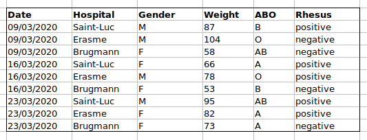
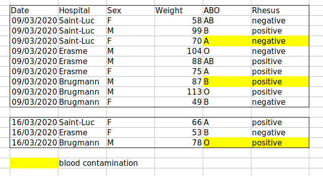
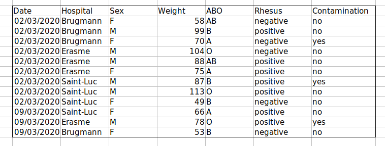
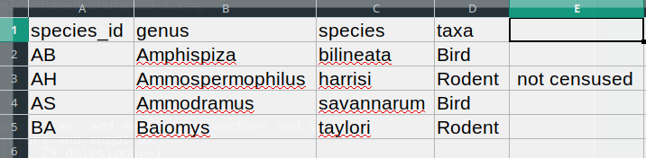

```{r, include=FALSE}
```

::::::::::::::::::::::::::::::::::::::: objectives

- Learn about spreadsheets, their strengths and weaknesses.
- How do we format data in spreadsheets for effective data use?
- Learn about common spreadsheet errors and how to correct them.
- Organise your data according to tidy data principles.
- Learn about text-based spreadsheet formats such as the comma-separated (CSV) or tab-separated (TSV) formats.

::::::::::::::::::::::::::::::::::::::::::::::::::

:::::::::::::::::::::::::::::::::::::::: questions

- How to organise tabular data?

::::::::::::::::::::::::::::::::::::::::::::::::::

> This episode is based on the Data Carpentries's *Data Analysis and
> Visualisation in R for Ecologists* lesson.

## Spreadsheet programs

**Question**

- What are basic principles for using spreadsheets for good data
  organization?

**Objective**

- Describe best practices for organizing data so computers can make
  the best use of datasets.

**Keypoint**

- Good data organization is the foundation of any research project.

Good data organization is the foundation of your research
project. Most researchers have data or do data entry in
spreadsheets. Spreadsheet programs are very useful graphical
interfaces for designing data tables and handling very basic data
quality control functions. See also @Broman:2018.

### Spreadsheet outline

Spreadsheets are good for data entry. Therefore we have a lot of data
in spreadsheets.  Much of your time as a researcher will be spent in
this 'data wrangling' stage.  It's not the most fun, but it's
necessary. We'll teach you how to think about data organization and
some practices for more effective data wrangling.

### What this lesson will not teach you

- How to do *statistics* in a spreadsheet
- How to do *plotting* in a spreadsheet
- How to *write code* in spreadsheet programs

If you're looking to do this, a good reference is [Head First
Excel](https://www.amazon.com/Head-First-Excel-learners-spreadsheets/dp/0596807694/),
published by O'Reilly.

### Why aren't we teaching data analysis in spreadsheets

- Data analysis in spreadsheets usually requires a lot of manual
  work. If you want to change a parameter or run an analysis with a
  new dataset, you usually have to redo everything by hand. (We do
  know that you can create macros, but see the next point.)

- It is also difficult to track or reproduce statistical or plotting
  analyses done in spreadsheet programs when you want to go back to
  your work or someone asks for details of your analysis.

Many spreadsheet programs are available. Since most participants
utilise Excel as their primary spreadsheet program, this lesson will
make use of Excel examples. A free spreadsheet program that can also
be used is LibreOffice. Commands may differ a bit between programs,
but the general idea is the same.

Spreadsheet programs encompass a lot of the things we need to be able
to do as researchers. We can use them for:

- Data entry
- Organizing data
- Subsetting and sorting data
- Statistics
- Plotting

Spreadsheet programs use tables to represent and display data. Data
formatted as tables is also the main theme of this chapter, and we
will see how to organise data into tables in a standardised way to
ensure efficient downstream analysis.

:::::::::::::::::::::::::::::::::::::::  challenge

## Challenge: Discuss the following points with your neighbour

- Have you used spreadsheets, in your research, courses,
  or at home?
- What kind of operations do you do in spreadsheets?
- Which ones do you think spreadsheets are good for?
- Have you accidentally done something in a spreadsheet program that made you
  frustrated or sad?


::::::::::::::::::::::::::::::::::::::::::::::::::

### Problems with spreadsheets

Spreadsheets are good for data entry, but in reality we tend to
use spreadsheet programs for much more than data entry. We use them
to create data tables for publications, to generate summary
statistics, and make figures.

Generating tables for publications in a spreadsheet is not
optimal - often, when formatting a data table for publication, we're
reporting key summary statistics in a way that is not really meant to
be read as data, and often involves special formatting
(merging cells, creating borders, making it pretty). We advise you to
do this sort of operation within your document editing software.

The latter two applications, generating statistics and figures, should
be used with caution: because of the graphical, drag and drop nature of
spreadsheet programs, it can be very difficult, if not impossible, to
replicate your steps (much less retrace anyone else's), particularly if your
stats or figures require you to do more complex calculations. Furthermore,
in doing calculations in a spreadsheet, it's easy to accidentally apply a
slightly different formula to multiple adjacent cells. When using a
command-line based statistics program like R or SAS, it's practically
impossible to apply a calculation to one observation in your
dataset but not another unless you're doing it on purpose.

### Using spreadsheets for data entry and cleaning

In this lesson, we will assume that you are most likely using Excel as
your primary spreadsheet program - there are others (gnumeric, Calc
from OpenOffice), and their functionality is similar, but Excel seems
to be the program most used by biologists and biomedical researchers.

In this lesson we're going to talk about:

1. Formatting data tables in spreadsheets
2. Formatting problems
3. Exporting data

## Formatting data tables in spreadsheets

**Questions**

- How do we format data in spreadsheets for effective data use?

**Objectives**

- Describe best practices for data entry and formatting in
  spreadsheets.

- Apply best practices to arrange variables and observations in a
  spreadsheet.

**Keypoints**

- Never modify your raw data. Always make a copy before making any
  changes.

- Keep track of all of the steps you take to clean your data in a
  plain text file.

- Organise your data according to tidy data principles.

The most common mistake made is treating spreadsheet programs like lab
notebooks, that is, relying on context, notes in the margin, spatial
layout of data and fields to convey information. As humans, we can
(usually) interpret these things, but computers don't view information
the same way, and unless we explain to the computer what every single
thing means (and that can be hard!), it will not be able to see how
our data fits together.

Using the power of computers, we can manage and analyse data in much
more effective and faster ways, but to use that power, we have to set
up our data for the computer to be able to understand it (and
computers are very literal).

This is why it's extremely important to set up well-formatted tables
from the outset - before you even start entering data from your very
first preliminary experiment. Data organization is the foundation of
your research project. It can make it easier or harder to work with
your data throughout your analysis, so it's worth thinking about when
you're doing your data entry or setting up your experiment. You can
set things up in different ways in spreadsheets, but some of these
choices can limit your ability to work with the data in other programs
or have the you-of-6-months-from-now or your collaborator work with
the data.

**Note:** the best layouts/formats (as well as software and
interfaces) for data entry and data analysis might be different. It is
important to take this into account, and ideally automate the
conversion from one to another.

### Keeping track of your analyses

When you're working with spreadsheets, during data clean up or
analyses, it's very easy to end up with a spreadsheet that looks very
different from the one you started with. In order to be able to
reproduce your analyses or figure out what you did when a reviewer or
instructor asks for a different analysis, you should

- create a new file with your cleaned or analysed data. Don't modify
  the original dataset, or you will never know where you started!

- keep track of the steps you took in your clean up or analysis. You
  should track these steps as you would any step in an experiment. We
  recommend that you do this in a plain text file stored in the same
  folder as the data file.

This might be an example of a spreadsheet setup:


Put these principles into practice today during your exercises.

While versioning is out of scope for this course, you can look at the
Carpentries lesson on
['Git'](https://swcarpentry.github.io/git-novice/) to learn how to
maintain **version control** over your data. See also this [blog
post](https://lgatto.github.io/github-intro/) for a quick tutorial or
@Perez-Riverol:2016 for a more research-oriented use-case.

### Structuring data in spreadsheets

The cardinal rules of using spreadsheet programs for data:

1. Put all your variables in columns - the thing you're measuring,
  like 'weight' or 'temperature'.
2. Put each observation in its own row.
3. Don't combine multiple pieces of information in one cell. Sometimes
  it just seems like one thing, but think if that's the only way
  you'll want to be able to use or sort that data.
4. Leave the raw data raw - don't change it!
5. Export the cleaned data to a text-based format like CSV
  (comma-separated values) format. This ensures that anyone can use
  the data, and is required by most data repositories.

For instance, we have data from patients that visited several
hospitals in Brussels, Belgium. They recorded the date of the visit,
the hospital, the patients' gender, weight and blood group.

If we were to keep track of the data like this:


the problem is that the ABO and Rhesus groups are in the same `Blood`
type column. So, if they wanted to look at all observations of the A
group or look at weight distributions by ABO group, it would be tricky
to do this using this data setup. If instead we put the ABO and Rhesus
groups in different columns, you can see that it would be much easier.



An important rule when setting up a datasheet, is that **columns are
used for variables** and **rows are used for observations**:

- columns are variables
- rows are observations
- cells are individual values

:::::::::::::::::::::::::::::::::::::::  challenge

## Challenge: We're going to take a messy dataset and describe how we would clean it up.

1. Download a messy dataset by clicking
  [here](https://github.com/UCLouvain-CBIO/WSBIM1207/raw/master/data/messy_covid.xlsx).

2. Open up the data in a spreadsheet program.

3. You can see that there are two tabs. The data contains various
  clinical variables recorded in various hospitals in Brussels during
  the first and second COVID-19 waves in 2020. As you can see, the
  data have been recorded differently during the March and November
  waves. Now you're the person in charge of this project and you want
  to be able to start analyzing the data.

4. With the person next to you, identify what is wrong with this
  spreadsheet. Also discuss the steps you would need to take to clean
  up first and second wave tabs, and to put them all together in one
  spreadsheet.

**Important:** Do not forget our first piece of advice: to create a
new file (or tab) for the cleaned data, never modify your original
(raw) data.


::::::::::::::::::::::::::::::::::::::::::::::::::

After you go through this exercise, we'll discuss as a group what was
wrong with this data and how you would fix it.

<!-- - Take about 10 minutes to work on this exercise. -->

<!-- - All the mistakes in the *common mistakes* section below are present -->

<!--   in the messy dataset. If the exercise is done during a workshop, ask -->

<!--   people what they saw as wrong with the data. As they bring up -->

<!--   different points, you can refer to the common mistakes or expand a -->

<!--   bit on the point they brought up. -->

<!-- - If you get a response where they've fixed the date, you can pause -->

<!--   and go to the dates lesson. Or you can say you'll come back to dates -->

<!--   at the end. -->

:::::::::::::::::::::::::::::::::::::::  challenge

## Challenge: Once you have tidied up the data, answer the following questions:

- How many men and women took part in the study?
- How many A, AB, and B types have been tested?
- As above, but disregarding the contaminated samples?
- How many Rhesus + and - have been tested?
- How many universal donors (O-) have been tested?
- What is the average weight of AB men?
- How many samples have been tested in the different hospitals?


::::::::::::::::::::::::::::::::::::::::::::::::::

An **excellent reference**, in particular with regard to R scripting
is the *Tidy Data* paper @Wickham:2014.

## Common spreadsheet errors

**Questions**

- What are some common challenges with formatting data in spreadsheets
  and how can we avoid them?

**Objectives**

- Recognise and resolve common spreadsheet formatting problems.

**Keypoints**

- Avoid using multiple tables within one spreadsheet.
- Avoid spreading data across multiple tabs.
- Record zeros as zeros.
- Use an appropriate null value to record missing data.
- Don't use formatting to convey information or to make your spreadsheet look pretty.
- Place comments in a separate column.
- Record units in column headers.
- Include only one piece of information in a cell.
- Avoid spaces, numbers and special characters in column headers.
- Avoid special characters in your data.
- Record metadata in a separate plain text file.

<!-- This lesson is meant to be used as a reference for discussion as -->

<!-- learners identify issues with the messy dataset discussed in the -->

<!-- previous lesson. Instructors: don't go through this lesson except to -->

<!-- refer to responses to the exercise in the previous lesson. -->

There are a few potential errors to be on the lookout for in your own
data as well as data from collaborators or the Internet. If you are
aware of the errors and the possible negative effect on downstream
data analysis and result interpretation, it might motivate yourself
and your project members to try and avoid them. Making small changes
to the way you format your data in spreadsheets, can have a great
impact on efficiency and reliability when it comes to data cleaning
and analysis.

- [Using multiple tables](#tables)
- [Using multiple tabs](#tabs)
- [Not filling in zeros](#zeros)
- [Using problematic null values](#null)
- [Using formatting to convey information](#formatting)
- [Using formatting to make the data sheet look pretty](#formatting_pretty)
- [Placing comments or units in cells](#units)
- [Entering more than one piece of information in a cell](#info)
- [Using problematic field names](#field_name)
- [Using special characters in data](#special)
- [Inclusion of metadata in data table](#metadata)

### Using multiple tables {#tables}

A common strategy is creating multiple data tables within one
spreadsheet. This confuses the computer, so don't do this!  When you
create multiple tables within one spreadsheet, you're drawing false
associations between things for the computer, which sees each row as
an observation. You're also potentially using the same field name in
multiple places, which will make it harder to clean your data up into
a usable form. The example below depicts the problem:


In the example above, the computer will see (for example) row 4 and
assume that all columns A-AF refer to the same sample. This row
actually represents four distinct samples (sample 1 for each of four
different collection dates - May 29th, June 12th, June 19th, and June
26th), as well as some calculated summary statistics (an average (avr)
and standard error of measurement (SEM)) for two of those
samples. Other rows are similarly problematic.

### Using multiple tabs {#tabs}

But what about workbook tabs? That seems like an easy way to organise
data, right? Well, yes and no. When you create extra tabs, you fail to
allow the computer to see connections in the data that are there (you
have to introduce spreadsheet application-specific functions or
scripting to ensure this connection). Say, for instance, you make a
separate tab for each day you take a measurement.

This isn't good practice for two reasons:

1. you are more likely to accidentally add inconsistencies to your
  data if each time you take a measurement, you start recording data
  in a new tab, and

2. even if you manage to prevent all inconsistencies from creeping in,
  you will add an extra step for yourself before you analyse the data
  because you will have to combine these data into a single
  datatable. You will have to explicitly tell the computer how to
  combine tabs - and if the tabs are inconsistently formatted, you
  might even have to do it manually.

The next time you're entering data, and you go to create another tab
or table, ask yourself if you could avoid adding this tab by adding
another column to your original spreadsheet. We used multiple tabs in
our example of a messy data file, but now you've seen how you can
reorganise your data to consolidate across tabs.

Your data sheet might get very long over the course of the
experiment. This makes it harder to enter data if you can't see your
headers at the top of the spreadsheet. But don't repeat your header
row. These can easily get mixed into the data, leading to problems
down the road. Instead you can [freeze the column
headers](https://support.office.com/en-ca/article/Freeze-column-headings-for-easy-scrolling-57ccce0c-cf85-4725-9579-c5d13106ca6a)
so that they remain visible even when you have a spreadsheet with many
rows.

### Not filling in zeros {#zeros}

It might be that when you're measuring something, it's usually a zero,
say the number of times a rabbit is observed in the survey. Why bother
writing in the number zero in that column, when it's mostly zeros?

However, there's a difference between a zero and a blank cell in a
spreadsheet. To the computer, a zero is actually data. You measured or
counted it. A blank cell means that it wasn't measured and the
computer will interpret it as an unknown value (also known as a null
or missing value).

The spreadsheets or statistical programs will likely misinterpret
blank cells that you intend to be zeros. By not entering the value of
your observation, you are telling your computer to represent that data
as unknown or missing (null). This can cause problems with subsequent
calculations or analyses. For example, the average of a set of numbers
which includes a single null value is always null (because the
computer can't guess the value of the missing observations). Because
of this, it's very important to record zeros as zeros and truly
missing data as nulls.

### Using problematic null values {#null}

**Example**: using -999 or other numerical values (or zero) to
represent missing data.

**Solutions**:

There are a few reasons why null values get represented differently
within a dataset. Sometimes confusing null values are automatically
recorded from the measuring device. If that's the case, there's not
much you can do, but it can be addressed in data cleaning with a tool
like
[OpenRefine](https://www.datacarpentry.org/OpenRefine-ecology-lesson/)
before analysis. Other times different null values are used to convey
different reasons why the data isn't there. This is important
information to capture, but is in effect using one column to capture
two pieces of information. Like for [using formatting to convey
information](#formatting) it would be good here to create a new
column like 'data\_missing' and use that column to capture the
different reasons.

Whatever the reason, it's a problem if unknown or missing data is
recorded as -999, 999, or 0.

Many statistical programs will not recognise that these are intended
to represent missing (null) values. How these values are interpreted
will depend on the software you use to analyse your data. It is
essential to use a clearly defined and consistent null indicator.

Blanks (most applications) and NA (for R) are good
choices. @White:2013 explain good choices for indicating null values
for different software applications in their article:


### Using formatting to convey information {#formatting}

**Example**: highlighting cells, rows or columns that should be
excluded from an analysis, leaving blank rows to indicate
separations in data.



**Solution**: create a new field to encode which data should be
excluded.



### Using formatting to make the data sheet look pretty {#formatting\_pretty}

**Example**: merging cells.

**Solution**: If you're not careful, formatting a worksheet to be more
aesthetically pleasing can compromise your computer's ability to see
associations in the data. Merged cells will make your data unreadable
by statistics software. Consider restructuring your data in such a way
that you will not need to merge cells to organise your data.

### Placing comments or units in cells {#units}

Most analysis software can't see Excel or LibreOffice comments, and
would be confused by comments placed within your data cells. As
described above for formatting, create another field if you need to
add notes to cells. Similarly, don't include units in cells: ideally,
all the measurements you place in one column should be in the same
unit, but if for some reason they aren't, create another field and
specify the units the cell is in.

### Entering more than one piece of information in a cell {#info}

**Example**: Recording ABO and Rhesus groups in one cell, such as A+,
B+, A-, ...

**Solution**: Don't include more than one piece of information in a
cell. This will limit the ways in which you can analyse your data.  If
you need both these measurements, design your data sheet to include
this information. For example, include one column for the ABO group and
one for the Rhesus group.

### Using problematic field names {#field\_name}

Choose descriptive field names, but be careful not to include spaces,
numbers, or special characters of any kind. Spaces can be
misinterpreted by parsers that use whitespace as delimiters and some
programs don't like field names that are text strings that start with
numbers.

Underscores (`_`) are a good alternative to spaces. Consider writing
names in camel case (like this: ExampleFileName) to improve
readability. Remember that abbreviations that make sense at the moment
may not be so obvious in 6 months, but don't overdo it with names that
are excessively long. Including the units in the field names avoids
confusion and enables others to readily interpret your fields.

**Examples**

| Good Name        | Good Alternative  | Avoid             |
| ---------------- | ----------------- | ----------------- |
| Max\_temp\_C       | MaxTemp           | Maximum Temp (°C) |
| Precipitation\_mm | Precipitation     | precmm            |
| Mean\_year\_growth | MeanYearGrowth    | Mean growth/year  |
| sex              | sex               | M/F               |
| weight           | weight            | w.                |
| cell\_type        | CellType          | Cell Type         |
| Observation\_01   | first\_observation | 1st Obs           |

### Using special characters in data {#special}

**Example**: You treat your spreadsheet program as a word processor
when writing notes, for example copying data directly from Word or
other applications.

**Solution**: This is a common strategy. For example, when writing
longer text in a cell, people often include line breaks, em-dashes,
etc. in their spreadsheet. Also, when copying data in from
applications such as Word, formatting and fancy non-standard
characters (such as left- and right-aligned quotation marks) are
included. When exporting this data into a coding/statistical
environment or into a relational database, dangerous things may occur,
such as lines being cut in half and encoding errors being thrown.

General best practice is to avoid adding characters such as newlines,
tabs, and vertical tabs. In other words, treat a text cell as if it
were a simple web form that can only contain text and spaces.

### Inclusion of metadata in data table {#metadata}

**Example**: You add a legend at the top or bottom of your data table
explaining column meaning, units, exceptions, etc.

**Solution**: Recording data about your data ("metadata") is
essential. You may be on intimate terms with your dataset while you
are collecting and analysing it, but the chances that you will still
remember that the variable "sglmemgp" means single member of group,
for example, or the exact algorithm you used to transform a variable
or create a derived one, after a few months, a year, or more are slim.

As well, there are many reasons other people may want to examine or
use your data - to understand your findings, to verify your findings,
to review your submitted publication, to replicate your results, to
design a similar study, or even to archive your data for access and
re-use by others. While digital data by definition are
machine-readable, understanding their meaning is a job for human
beings. The importance of documenting your data during the collection
and analysis phase of your research cannot be overestimated,
especially if your research is going to be part of the scholarly
record.

However, metadata should not be contained in the data file
itself. Unlike a table in a paper or a supplemental file, metadata (in
the form of legends) should not be included in a data file since this
information is not data, and including it can disrupt how computer
programs interpret your data file. Rather, metadata should be stored
as a separate file in the same directory as your data file, preferably
in plain text format with a name that clearly associates it with your
data file. Because metadata files are free text format, they also
allow you to encode comments, units, information about how null values
are encoded, etc. that are important to document but can disrupt the
formatting of your data file.

Additionally, file or database level metadata describes how files that
make up the dataset relate to each other; what format they are in; and
whether they supercede or are superceded by previous files. A
folder-level readme.txt file is the classic way of accounting for all
the files and folders in a project.

(Text on metadata adapted from the online course Research Data
[MANTRA](https://datalib.edina.ac.uk/mantra) by EDINA and Data Library,
University of Edinburgh. MANTRA is licensed under a [Creative Commons
Attribution 4.0 International
License](https://creativecommons.org/licenses/by/4.0/).)

## Exporting data

**Question**

- How can we export data from spreadsheets in a way that is useful for
  downstream applications?

**Objectives**

- Store spreadsheet data in universal file formats.
- Export data from a spreadsheet to a CSV file.

**Keypoints**

- Data stored in common spreadsheet formats will often not be read
  correctly into data analysis software, introducing errors into your
  data.

- Exporting data from spreadsheets to formats like CSV or TSV puts it
  in a format that can be used consistently by most programs.

Storing the data you're going to work with for your analyses in Excel
default file format (`*.xls` or `*.xlsx` - depending on the Excel
version) isn't a good idea. Why?

- Because it is a proprietary format, and it is possible that in the
  future, technology won't exist (or will become sufficiently rare) to
  make it inconvenient, if not impossible, to open the file.

- Other spreadsheet software may not be able to open files saved in a
  proprietary Excel format.

- Different versions of Excel may handle data differently, leading to
  inconsistencies. [Dates](https://datacarpentry.org/spreadsheet-ecology-lesson/03-dates-as-data/index.html)
  is a well-documented example of inconsistencies in data storage.

- Finally, more journals and grant agencies are requiring you to
  deposit your data in a data repository, and most of them don't
  accept Excel format. It needs to be in one of the formats discussed
  below.

- The above points also apply to other formats such as open data
  formats used by LibreOffice / Open Office. These formats are not
  static and do not get parsed the same way by different software
  packages.

Storing data in a universal, open, and static format will help deal
with this problem. Try tab-delimited (tab separated values or TSV) or
comma-delimited (comma separated values or CSV). CSV files are plain
text files where the columns are separated by commas, hence 'comma
separated values' or CSV. The advantage of a CSV file over an
Excel/SPSS/etc. file is that we can open and read a CSV file using
just about any software, including plain text editors like TextEdit or
NotePad. Data in a CSV file can also be easily imported into other
formats and environments, such as SQLite and R. We're not tied to a
certain version of a certain expensive program when we work with CSV
files, so it's a good format to work with for maximum portability and
endurance. Most spreadsheet programs can save to delimited text
formats like CSV easily, although they may give you a warning during
the file export.

To save a file you have opened in Excel in CSV format:

1. From the top menu select 'File' and 'Save as'.
2. In the 'Format' field, from the list, select 'Comma Separated
  Values' (`*.csv`).
3. Double check the file name and the location where you want to save
  it and hit 'Save'.

An important note for backwards compatibility: you can open CSV files
in Excel!

```{r, results="markup", fig.cap="Saving an Excel file to CSV.", echo=FALSE, purl=FALSE, out.width="70%", fig.align="center"}
knitr::include_graphics("fig/excel-to-csv.png")
```

**A note on R and `xls`**: There are R packages that can read `xls`
files (as well as Google spreadsheets). It is even possible to access
different worksheets in the `xls` documents.

**But**

- some of these only work on Windows.
- this equates to replacing a (simple but manual) export to `csv` with
  additional complexity/dependencies in the data analysis R code.
- data formatting best practice still apply.
- Is there really a good reason why `csv` (or similar) is not
  adequate?

### Caveats on commas

In some datasets, the data values themselves may include commas
(,). In that case, the software which you use (including Excel) will
most likely incorrectly display the data in columns. This is because
the commas which are a part of the data values will be interpreted as
delimiters.

For example, our data might look like this:

```
species_id,genus,species,taxa
AB,Amphispiza,bilineata,Bird
AH,Ammospermophilus,harrisi,Rodent, not censused
AS,Ammodramus,savannarum,Bird
BA,Baiomys,taylori,Rodent
```

In the record `AH,Ammospermophilus,harrisi,Rodent, not censused` the
value for `taxa` includes a comma (`Rodent, not censused`).  If we try
to read the above into Excel (or other spreadsheet program), we will
get something like this:

```{r, results="markup", fig.cap="The risks of having commas inside comma-separated data.", echo=FALSE, purl=FALSE, out.width="80%", fig.align="center"}

```

The value for `taxa` was split into two columns (instead of being put
in one column `D`). This can propagate to a number of further
errors. For example, the extra column will be interpreted as a column
with many missing values (and without a proper header). In addition to
that, the value in column `D` for the record in row 3 (so the one
where the value for 'taxa' contained the comma) is now incorrect.

If you want to store your data in `csv` format and expect that your
data values may contain commas, you can avoid the problem discussed
above by putting the values in quotes (""). Applying this rule, our
data might look like this:

```
species_id,genus,species,taxa
"AB","Amphispiza","bilineata","Bird"
"AH","Ammospermophilus","harrisi","Rodent, not censused"
"AS","Ammodramus","savannarum","Bird"
"BA","Baiomys","taylori","Rodent"
```

Now opening this file as a `csv` in Excel will not lead to an extra
column, because Excel will only use commas that fall outside of
quotation marks as delimiting characters.

Alternatively, if you are working with data that contains commas, you
likely will need to use another delimiter when working in a
spreadsheet[^decsep]. In this case, consider using tabs as your delimiter and
working with TSV files. TSV files can be exported from spreadsheet
programs in the same way as CSV files.

[^decsep]: This is particularly relevant in European
countries where the comma is used as a decimal
separator. In such cases, the default value separator in a
csv file will be the semi-colon (;), or values will be
systematically quoted.

If you are working with an already existing dataset in which the data
values are not included in "" but which have commas as both delimiters
and parts of data values, you are potentially facing a major problem
with data cleaning. If the dataset you're dealing with contains
hundreds or thousands of records, cleaning them up manually (by either
removing commas from the data values or putting the values into
quotes - "") is not only going to take hours and hours but may
potentially end up with you accidentally introducing many errors.

Cleaning up datasets is one of the major problems in many scientific
disciplines. The approach almost always depends on the particular
context. However, it is a good practice to clean the data in an
automated fashion, for example by writing and running a script. The
Python and R lessons will give you the basis for developing skills to
build relevant scripts.

## Summary

```{r analysis, results="asis", fig.margin=TRUE, fig.cap="A typical data analysis workflow.", fig.width=7, fig.height=4, echo=FALSE, purl=FALSE}
knitr::include_graphics("fig/analysis.png")
```

A typical data analysis workflow is illustrated in the figure above,
where data is repeatedly transformed, visualised, and modelled. This
iteration is repeated multiple times until the data is understood. In
many real-life cases, however, most time is spent cleaning up and
preparing the data, rather than actually analysing and understanding
it.

An agile data analysis workflow, with several fast iterations of the
transform/visualise/model cycle is only feasible if the data is
formatted in a predictable way and one can reason about the data
without having to look at it and/or fix it.

:::::::::::::::::::::::::::::::::::::::: keypoints

- Good data organization is the foundation of any research project.

::::::::::::::::::::::::::::::::::::::::::::::::::
